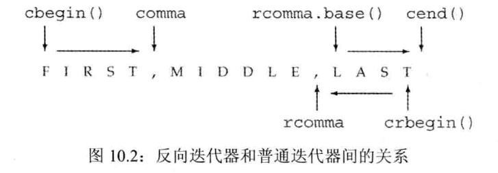

PART 2 C++标准库

# 8 IO 库

## 8.1 IO 类
|头文件|类型|
|---|---|
|iostream|istream, wisdtream 从流读取数据<br>ostream, wostream 向流写入数据<br>iostream, wisotream 读写流|
|fstream|ifstream, wifstream 从文件读取<br>ofstream, wofstream 向文件写入数据<br>fstream, wfstream读写文件|
|sstream|istringstream, wistringstream 从 string 读取数据<br>ostringstream, wostringstream 向 string 写入数据 <br>stringstream, wstringstream 读写 string|

为了支持宽字符语言，标准库定义了一组类型和对象来操纵 wchar_t 类型的数据，宽字符版本以一个 w 开始

- IO 类型间的关系
    标准库可以使我们忽略这些不同类型的流之间的差异，通过继承机制实现
    继承机制声明一个特定的类继承自另一个类，我们通常可以将一个派生类(继承类)对象当作其基类对象来使用

### 8.1.1 IO 对象无拷贝或赋值
不能拷贝或对 IO 对象赋值

读写一个 IO 对象会改变其状态，因此传递和返回的引用不能是 const 的

### 8.1.2 条件状态

|sentences|expression|
|---|---|
|strm::iostate|strm一种IO类型，提供了表达条件状态的完整功能|
|strm::badbit|指出流已崩溃|
|strm::failbit|指出一个IO操作失败了|
|strm::eofbit|流到达了文件结束|
|strm::goodbit|流未处于错误状态，此值保证为零|
|s.eof()|eofbit置位 true|
|s.fail()|failbit置位 true|
|s.bad()|batbit置位 true|
|s.good()|有效状态 true|
|s.clear()|将所有条件状态复位，设置为有效 返回 void|
|s.clear(flag)|将s中对应条件状态位复位 返回void|
|s.setstate(flag)|flags标志位，将对应条件状态置位 返回void|
|s.rdstate()|返回当前状态, 返回类型位 strm::iostate|


一旦一个流发生错误，其上后续的 IO 操作都会失败，只有当一个流处于无措状态时，才可以从它读取数据，向它写入数据

确定一个流对象的状态的最简单的方法是将它当作一个对象来使用  
`while(cin>>word)`

- 查询流的状态
    将流当作条件使用代码等价于 `fail()`
- 管理状态条件

### 8.1.3 管理输出缓冲
- 原因
    - 程序正确结束
    - 缓冲区满时，需要刷新缓冲
    - endl等操作符显式刷新缓冲区
    - 用操作符unitbuf 设置流的内部状态
    - 当读写被关联的流时，关联道德流的缓冲区会被刷新
- 刷新输出缓冲区
    - endl
    - flush 刷新但不输出任何额外字符
    - ends 向缓冲区插入一个空字符，然后刷新
- unitbuf 操作符
```cpp
cout<< unitbuf //所有输出操作都会立即刷新缓冲区
cout << nounitebuf //回到正常的缓冲方法
```
- 关联输入和输出流

## 8.2 文件输入输出
`ifstream`从一个给定文件读取数据  
`ofstream`向一个给定文件写入数据  
`fstream`可以读写文件  

`fstream` 特有操作
|||
|---|---|
|fstream fstrm|创建一个未绑定的文件流|
|fstream fstrm(s)|创建一个fstream，应打开名为s的文件|
|fstream fstrm(s,mode)|指定mode打开文件|
|fstrm.open(s)|打开名为s的文件，与fstrm绑定|
|fstrm.close()|关闭与fstrm绑定的文件|
|fstrm.is_open|返回一个bool值，指出与fstrm关联的文件是否成功打开且尚未关闭|

### 8.2.1 使用文件流对象
- 用 fstram 代替 iostream&
- 成员函数 open 和 close
定义一个空文件六对象，随后调用 open 将它与文件关联起来
```cpp
ifstream in(ifile);
ofstream out;
out.open(ifile + ",copy")
```
进行 open 是否成功的检测
`if(out)`

- 自动构造和析构
当一个 fstream对象被销毁时，close 会自动调用

### 8.2.2
每个流都有一个关联的文件模式
|||
|---|---|
|in|以读方式打开|
|out|以写方式打开|
|app|每次写操作前均定位到文件末尾|
|ate|打开文件后立即定位到文件末尾|
|trune|阶段文件|
|binary|以二进制方式进行IO|

- 以out模式打开文件会丢弃已有数据
默认情况下，当我们打开一个 ofstream 时，文件的内容会被丢弃，阻止一个 ofstream 清空给定文件内容的方式是同时指定 app 模式
```cpp
ofstream app("file2", ofstream::app);
ofstream app2("file2", ofstream::out | ofstram::app);
```
- 每次调用 open 时都会确定文件模式
每次打开文件时，都要设置文件模式，可能是显式地设置，也可能是隐式地设置，当程序未指定模式时，就是用默认值


## 8.3 string 流
`istringstream` 从string对取数据  
`ostringstream` 向string写入数据
`stringstream` 既可从string读数据也可向string写数据  
`stringstream` 特有地操作  
|||
|---|---|
|sstream strm|strm是一个未绑定地stringstream对象，sstream是头文件sstream中定义地一个类型|
|sstream strm(s)|strm是一个sstream对象，保存string s 地一个拷贝，此构造函数是explicit的|
|strm.str()|返回strm所保存的string的拷贝|
|strm.str(s)|将string s 拷贝到strm中，返回 void|

### 8.3.1 使用 istringstream
当某些工作是对整行文本进行处理，而其他一些工作是处理行内的单个单词时，通常可以使用 istringstream
```cpp
struct PersonInfo {
    string name;
    vector<string> phones;
};
string line, word;
vector<PersonInfo> people;
while (getline(cin,line)){
    PersonInfo info;
    istringstream record(line);
    record >> info.name;
    while (record >> word)
        info.phones.push_back(word);
    people.push_back(info);
}
```

### 使用 ostringstream
通过将内容写入到一个内存 ostringstream 中再统一进行输出

# 9 顺序容器

## 9.1 顺序容器概述
- 向容器添加或从容器中删除元素的代价
- 非顺序访问容器中元素的代价  

顺序容器类型  
|||
|---|---|
|vector|可变大小数组，支持快速随机访问，在尾部之外的位置插入或删除元素可能很慢|
|deque|双端队列，支持快速随机访问，在头尾位置插入删除速度很快|
|list|单向链表，只支持单向顺序访问，在链表任何位置进行插入/删除操作速度很快|
|forward_list|单向列表，只支持单向顺序访问，在链表任何位置进行插入/删除操作速度都很快|
|array|固定大小数组，支持快速随机访问，不能添加或删除元素|
|string|与vector相似的容器，但专门用于保存字符，随机访问快，在尾部插入删除速度块|

- 确定使用哪种顺序容器
    通常，使用vector是最好的选择，除非你有很好的理由选择其他容器
    - 如果你的程序有很多小的元素，且空间额外开销很重要，则不要使用list 或 forward_list
    - 如果程序要求随机访问元素，应使用 vector 或 deque
    - 如果程序要求在容器的中间插入或删除元素，应使用 list 或 forward_list
    - 如果程序需要在头尾位置插入或删除元素，但不会在中间位置进行插入或删除操作，则使用 deque
    - 如果程序只有在读取输入时才需要在容器中间位置插入元素，随后需要随机访问元素，则
        - 调用sort函数重排 vector 避免在中间位置添加元素
        - 考虑在输入阶段使用 list ，一旦输入完成，将内容拷贝到 vector 中
    
## 9.2 容器库概览
- 容器类型上的操作形成了一种层次
    - 某些操作是所有容器类型都提供的
    - 另外一些操作仅针对顺序容器、关联容器或无序容器
    - 还有一些操作只适用于一小部分容器

- 对容器可以保存的元素类型的限制
    - 较旧的编辑器可能需要再练个尖括号之间键入空格

### 9.2.1 迭代器
- 迭代器范围
    - 由一对迭代器表示，分别指向同一个容器中的元素或者尾元素之后的位置，属于左闭右合区间
- 使用左闭右合范围蕴含的编程设定
    - begin 与 end 想等，则范围为空
    - 如果 begin 与 end 不等，则范围至少包含一个元素，且 begin 指向该范围中的第一个元素
    - 我们可以对 begin 递增若干次，使得 begin == end

### 9.2.2 容器类型成员
```cpp
//通过 list<string>定义的一个迭代器类型
list<string>::iterator iter;
//通过 vector<int> 定义的difference_type
vector<int>::difference_type count;
```

### 9.2.3 begin 和 end 成员
begin 和 end 具有多版本  
```cpp
list<string> a = {"a","b","c"};
auto it1 = a.begin(); // list<string>::iterator
auto it2 = a.rbegin(); // list<string>::reverse_iterator
auto it3 = a.cbegin(); // list<string>::const_iterator
auto it4 = a.crbegin(); // list<string>::const_reverse_iterator
```
当不需要写访问时，应使用 cbegin 和 cend

### 9.2.4 容器定义和初始化
- 将一个容器初始化未另一个容器的拷贝
    - 方法
        - 直接拷贝整个容器
        - 拷贝由一个迭代器对指定的元素范围(array除外)
    - 当将一个容器初始化为另一个容器的拷贝时，两个容器的容器类型和元素类型都必须相同
    ```cpp
    deque<string> authList(authors.begin(), it);
    // 拷贝元素，直到（但不包括）it 指向的元素
    ```
- 列表初始化
- 与顺序容器大小相关的构造函数
    只有顺序容器的构造函数才接受大小参数，并联容器并不支持
- 标准库 array 具有固定大小
    - 当定义一个 array 时，除了指定元素类型，还要指定容器大小
  
### 9.2.5 赋值和 swap
- 容器赋值运算
    |||
    |---|---|
    |c1 = c2|将c1中的元素替换为c2中元素的拷贝，c1 c2 必须具有相同的类型|
    |c = {a,b,c}|将c1中元素替换为初始化列表中元素的拷贝(array不适用)|
    |swap(c1,c2)<br>c1.swap(c2)|交换c1和c2中的而元素，两者必须具有相同的类型，swqp通常比从c2向c1拷贝元素快得多|
    |seq.assign(b,e)|将seq中的元素替换为迭代器b和e所表示的范围中的元素，迭代器b和e不能指向seq中的元素|
    |seq.assign(i1)|将swq中的元素替换为初始值列表i1中的元素|
    |seq.assign(n,t)|将seq中的元素替换为n个值为t|
- 使用 assign (仅顺序容器)
    - 赋值运算
        - 要求左边和右边的运算对象具有相同的类型
        - 将右边运算对象中所有元素拷贝到左边运算对象中
    - assign 允许我们从一个不同但相容的类型赋值，或者从容器中的一个子序列赋值
    - saaign 操作用参数所指定的元素的拷贝替换左边容器中的元素
- 使用 swap
    - swap操作会交换两个相同类型容器的内容
    - swap 不对任何元素进行拷贝、删除或插入操作，因此可保证在常数时间内完成
    - 指向容器的迭代器、引用和指针在 swap 操作之后不会失效，仍指向 swap 操作之前的那些元素
  
### 9.2.6 容器大小操作
1. 成员函数 size 返回容器中元素的数目
2. empty 当 size 为 0 时返回布尔值 true，否则返回 false
3. max_size 返回一个大于或等于该类型容器所能容纳的最大元素值
4. forward_list 支持 max_size 和 empty， 但不支持 size

### 9.2.7 关系运算符
- 所有容器都支持相等运算符(==,!=)
- 除了无序关联容器外的所有容器都支持关系运算符(>,>=,<,<=) 
- 关系运算符两边的运算对象必须是相同类型的容器，且必须保存相同类型的元素
两个容器的比较
1. 如果两个容器具有相同大小且所有元素都两两对应想等，则这两个容器想等；否则不等
2. 如果两个容器大小不同，但较小的容器每个元素都等于较大容器中的对应元素，则较小容器小于较大容器
3. 如果两个容器都不是另一个容器的前缀子序列，则他们的比较结果取决于第一个不相等的元素的比较结果

- 容器的关系运算符使用元素的关系运算符完成比较


## 9.3 顺序容器操作

### 9.3.1 向顺序容器添加元素
向一个 vector string deque 插入元素会使所有指向容器的迭代器、引用和指针失效  

- 使用 push_back
    - 将一个元素追加到一个容器的尾部
    - 当我们用一个对象来初始化元素时，或将一个对象插入到容器中时，实际上放入到容器中的是对象值的一个拷贝，而不是对象本身
- 使用 push_front
    - list, forward_list, deque 支持将元素插入到容器头部
- 在容器中的特定位置添加元素
    - vector, deque, list, string 支持insert成员
    - forward_list 具有特殊的 insert 成员
    - 将元素插入到 vector, deque 和 string 中的任何位置都是合法的，然而这样做可能很耗时
- 插入范围元素
    - `svec.insert(sevc.end(), 10, "anna")` 将10个元素插入到 svec 的尾部
    - 接受元素个数或范围的 insert 版本返回指向第一个新加入元素的迭代器
- 使用 insert 的返回值
- 使用 emplace 操作
    - 根据元素的类型而变化，参数必须与元素类型的构造函数相匹配
  
### 9.3.2 访问元素
- 包括 arrary 在内的每个顺序容器都有一个 front 成员函数
- 除 forward_list 之外的所有容器都有一个 back 成员函数

|||
|---|---|
|c.back()|返回 c 中尾元素的引用|
|c.front()|返回 c 中首元素的引用|
|c[n]|返回 c 中下标为 n 的元素的引用|
|c.at(n)|返回下标为 n 的元素的引用|

- 访问成员函数返回的是引用
    使用 auto 变量来保存函数的返回值

- 下标操作和安全的随机访问
  

### 9.3.3 删除元素
|||
|---|---|
|c.pop_back()|删除 c 中的尾元素|
|c.pop_front()|删除 c 中首元素|
|c.erase(p)|删除迭代器 p 所指定的元素，返回一个只想被删元素之后元素的迭代器|
|c.erase(b,e)|删除迭代器 b 和 e 所指定范围内的元素，返回一个指向最后一个被删元素之后元素的迭代器|
|c.clear()|删除 c 中所有元素|

- pop_front 和 pop_back 成员函数

- 从容器内部删除一个元素
    erase 可以从容器中指定位置删除元素，我们可以删除由一个迭代器指定的单个元素，也可以删除由一对迭代器指定的范围内的所有元素
- 删除多个元素
    - 删除所有元素 
    ```cpp
    slist.clear();
    slist.erase(slist.bvegin(), slist.end()); //二者等价
    ```

### 9.3.4 特殊的 forward_list 操作
当添加或删除一个元素时，删除或添加的元素之前的那个元素的后继会发生改变  
为了添加或删除一个元素，我们需要访问其前驱，以改变前驱的链接
定义了 before_begin(返回一个首前迭代器)
1. insert_after
2. emplace_after
3. erase_after

### 9.3.5 改变容器大小
用 resize 来增大或缩小容器
|||
|---|---|
|c.resize(n)|调整 c 的大小为 n 个元素，若 n<c.size() 则多出的元素会被丢弃，若必须添加新元素，对新元素初始化|
|c.resize(n,t)|调整 c 的大小为 n 个元素，任何新添加的元素都初始值为值 t|


### 9.3.6 容器操作可能使迭代器失效
- 添加元素
    - 容器是vector 或 string ，且存储空间重新分配，则指向插入位置之前的元素的迭代器、指针和引用都会失效
    - 对于 deque，插入到除首尾位置之外的任何位置都会导致迭代器、指针和引用失效，如果在首尾位置添加元素，迭代器会失效
    - 对于 list 和 forward_list，指向容器的迭代器和首前迭代器、指针和引用仍有效
- 删除元素
    - 对于 list 和 forward_list，只想容器其他位置的迭代器、引用和指针仍有效
    - 对于 deque，如果在首尾之外的任何位置删除元素，那么指向被删除元素外其他元素的迭代器、引用或指针也会失效；删除尾元素，尾后迭代器影响；删除首元素，这些不会影响
    - 对于 vector 和 string，指向被删元素之前的迭代器、引用和指针仍有效
- 编写改变容器的循环程序
    ```cpp
    vector<int> vi = {0,1,2,3,4,5,6,7,8,9};
    auto iter = vi.begin();
    whild(iter != vi.end()){
        if(iter != vi.end()){
            iter = vi.insert(iter, *iter);
            iter += 2; //向前移动迭代器
        } else
            iter = vi.erase(iter);
    }
    ```
    调用 erase 后，不必递增迭代器，erase 返回的迭代器已经指向序列中下一个元素  
    调用 insert 后，需要递增迭代器两次(insert 在给定位置之前插入新元素，然后返回指向新元素的迭代器)
- 不要保存 end 返回迭代器
    - 如果在一个循环中插入/删除 deque 、 string 或 vector 中的元素，不要缓存 end 返回的迭代器 


## 9.4 vector 对象是如何增长的
当不得不获取新的内存空间时，vector和 string的实现通常会分配比新的空间需求更大的内存空间  
- 管理容量的成员函数
    |||
    |---|---|
    |c.shrink_to_fit()|将 capacity()减少为与size()相同大小|
    |c.capacity()|不重新分配内存空间的话，c 可以保存多少元素|
    |c.reserve(n)|分配至少能容纳 n 个元素的内存空间|
- reseve 并不改变容器中元素的数量，它仅影响预先分配多大的内存空间
    调用 reserve 永远不会减少容器占用的内存空间
- capacity 和 size
    size 指它已经保存的元素的数目
    capacity 则是在不分配新的内存空间的前提下它最多可以保存多少元素
每个 vector 实现都可以选择自己的内存分配策略，但是必须遵守一条原则是，只有当迫不得已时才可以分配新的内存空间


## 9.5 额外的 string 操作

### 9.5.1 构造 string 的其他方法
|||
|---|---|
|string s(cp,n)|s 是 cp 指向的数组中前 n 个字符的拷贝。此数组至少应该包含 n 个字符|
|string s(s2,pos2)|s 是 string s2 从下标 pos2 开始的字符的拷贝。若 pos2>s2.size()，构造函数的行为未定义|
|string s(s2, pos2, len2)|s 是 string s2从下标pos2 开始 len2 个字符的拷贝。若pos2>s2.size()，构造函数的行为未定义。不管 len2 的值是多少，构造函数之多拷贝s2.size()-pos2个字符|

通常当我们从一个 const char*创建 string 时，指针指向的数组必须以空字符结尾，拷贝操作遇到空字符时停止  
如果传递给构造函数一个计数值，数组就不必以空字符结尾，如果我们未传递计数值且数组也未以空字符结尾，或者给定计数值大于数组大小，则构造函数的行为是未定义的  

- substr 操作
  - 返回一个 string，是原始string的一部分或全部的拷贝，可以传递给 substr 一个可选的开始位置和计数值

### 9.5.2 改变 string 的其他方法
除了接受迭代器的 insert 和 erase 版本外，string 还提供了接收下标的版本，下标指出了开始删除的位置，或是insert 到给定值之前的位置

- append 和 replace 函数
    - append 未在 string 末尾进行插入操作的一种简写形式
        - 将字符追加到末尾，返回一个指向字符串的引用
    - replace 是调用 erase 和 insert 的一种简写形式
        - 删除一个范围内的字符，替换为另一个字符
- 改变 string 的多重重载函数
    - assign 和 append 函数无须指定删除元素范围的方式，可以通过一个位置和一个长度来指定位置，也可以通过一个迭代器范围来指定
    - assign 总是替换 string 中的所有内容， append 总是将新字符追加到 string 末尾
    - insert 函数允许我们用两种方式指定插入点: 用一个下标或一个迭代器，在两种情况下，新元素都会插入到指定下标之前的位置
    - append 总是将新字符追加到 string 末尾

### 9.5.3 string 搜索操作
- 搜索成功，返回一个 `string::size_type` 值，表示匹配发生位置的下标  
- 搜索失败, 则返回一个名为 `string::nops`的 static 成员
    - 标准库将 nops 定义为一个 `const string::size_type` 类型，并初始化为 -1  

|||
|---|---|
|`s.find(args)`|查找 s 中 args 第一次出现的位置|
|`s.rfind(args)`|查找 s 中 args 最后一次出现的位置|
|`s.find_first_of(args)`|在 s 中查找 args 中任何一个字符第一次出现的位置|
|`s.find_last_of(args)`|在 s 中查找 args 中任何一个字符最后一次出现的位置|
|`s.find_first_not_of(args)`|在 s 中查找第一个不在 args 中的字符|
|`s.find_last_not_of(args)`|在 s 中查找最后一个不在 args 中的字符|

`args` 必须为以下形式
1. (`c,pos`) 从 s 中位置 pos 开始查找字符 c， 默认为0
2. (`s2,pos`) 从 s 中位置 pos 开始查找字符串 s2, 默认未0
3. (`cp,pos`) 从 s 中位置 pos 开始查找指针 cp 指向的以空字符串结尾的 C 风格字符串，默认为0
4. (`cp,pos,n`) 从 s 中位置 pos 开始查找指针 cp 指向的数组的前 n 个字符，无默认值

- 指定在哪里开始搜索
- 逆向搜索
    - `rfind`

### 9.5.4 compare 函数
根据 s 等于大于还是小于参数指定的字符串 返回 0 正数或负数
1. (`s2`) 比较 s 和 s2
2. (`pos1, n1, s2`) 将 s 中从 pos1 开始的 n1 个字符与 s2 进行比较
3. (`pos1, n1, s2, pos2, n2`) 将 s 中从 pos1 开始的 n1 个字符与 s2 中从 pos2 开始的 n2 个字符进行比较
4. (`cp`) 比较 s 与 cp 指向的以空字符串结尾的字符数组
5. (`pos1, n1, cp`) 将 s 中从 pos1 开始的 n1 个字符与 cp 指向的以空字符结尾的字符数组进行比较
6. (`pos1, n1, cp, n2`) 将 s 中从 pos1 开始的 n1 个字符与指针 cp 指向的地址开始的 n2 个字符进行比较

### 9.5.5 数值转换
```cpp
int i = 42;
string s = to_string(i);
double d = stod(s);
```
如果 string 不能转换成某个数值 `invalid_argument`
如果转换得出的数值无法用任何类型来表示 `out_of_range`

<br>

## 9.6 容器适配器
- 顺序容器适配器
  1. stack
  2. qwueue
  3. priority_queue  
<br>

- 容器适配器接受一种已有的容器类型，使其行为看起来像一种不同的类型  

- 所有容器适配器都支持的操作和类型
    |||
    |---|---|
    |`size_type`|一种类型，足以保存当前类型的最大对象的大小|
    |`value_type`|元素类型|
    |`container_type`|实现适配器的底层容器类型|
    |`A a;`|创建一个名为 a 的空适配器|
    |`A a(c)`|创建一个名为 a 的适配器，带有容器 c 的一个拷贝|
    |关系运算符|返回底层容器的比较结果|
    |`a.empty()`|若 a 包含任何元素，返回 false，否则返回 true|
    |`a.size()`|返回 a 中的元素数目|
    |`swap(a,b)`<br>`a.swap(b)`|交换 a 和 b 的内容， a 和 b 必须有相同类型，包括底层容器类型也必须相同|

- 定义一个适配器
    默认函数创建一个空对象，接受一个容器的构造函数拷贝该容器来初始化适配器
    可以在创建一个适配器时将一个命名的顺序容器作为第二个类型参数，来重载默认容器类型
    ```cpp
    stack<string, vector<string>> str_stk; //在 vector 上实现的空栈
    stack<string, vector<string>> str_stk2(svec); //str_stk2 在 vector 上实现，初始化时保存 svec 的拷贝
    ```
- 栈适配器
    |||
    |---|---|
    |`s.pop()`|删除栈顶元素，但不返回该元素值|
    |`s.push(item)`<br>`s.emplace(args)`|创建一个新元素压入栈顶，该元素通过拷贝或移动 item 而来，或者由 args 构造|
    |`s.top()`|返回栈顶元素，但不将元素弹出栈|
- 队列适配器
    |||
    |---|---|
    |`q.pop()`|返回 queue 的首元素或 priority_queue 的最高优先级的元素，但不删除此元素|
    |`q.front()`|返回首元素或尾元素，但不删除此元素|
    |`q.back()`|只适用于 queue|
    |`q.top`|返回最高优先级元素，但不删除该元素(只适用于 priority_queue)|
    |`q.push(item)`|在 queue 末尾或 priority_queue 中恰当的位置创建一个元素|
    |`q.emplace(args)`|其值为 item, 或者由 args 构造|

    一种先进先出的存储和访问策略，进入队列的对象被放置到队尾，而离开队列的对象则从队首删除

<br>

# 10 泛型算法

## 10.1 概述
<br>
大多数算法都定义在头文件 algorithm 中，标准库还在头文件 numeric 中定义了一组数值泛型算法。  

<br>
一般情况下,这些算法并不直接操作容器，而是遍历由两个迭代器指定的一个元素范围来进行操作

- 算法如何工作(find)
    1. 访问队列中的首元素
    2. 比较此元素与我们要查找的值匹配，find 返回标识此元素的值
    3. 如果此元素与我们要查找的值匹配，find 返回标识此元素的值
    4. 否则，find 前进到下一个元素，重复执行步骤2和3
    5. 如果到达队尾， find 应停止
    6. 如果 find 到达序列末尾，他应该返回一个指出元素未找到的值，此值和步骤 3 返回的值必须具有相容的类型
- 迭代器算法并不依赖于容器
- 算法依赖于元素类型的操作

## 10.2 初识泛型算法

### 10.2.1 只读算法
一些算法只会读取其输入范围内的元素，而从不改变元素
(find, count, accumulate)

- accumulate
    - 定义在头文件 numeric 中
    - 接受三个参数，前两个指出了需要求和的元素的范围，第三个参数是和的初值，初值决定了函数中使用哪个加法运算符以及返回值的类型
- 算法和元素类型
    - 对于只读取而不改变元素的算法，通常最好使用 cbegin() 和 cend()
- 操作两个序列的算法
    - equal 确定两个序列是否保存相同的值，它将第一个序列中的每个元素和第二个序列中的对应元素进行比较
        - 接受三个迭代器
            - `equal(roster1.cbegin(), roster1.cend(), roster2.cbegin())`
    - 只接受一个单一迭代器来表示第二个序列的算法都假定第二个序列至少与第一个序列一样长

### 10.2.2 写容器元素的算法
一些算法将新值赋予序列中的元素，当我们使用这类算法是，必须注意确保序列原大小至少不小于我们要求算法写入的元素数目

- fill 
    - 接受一对迭代器表示一个范围，还接受一个值作为第三个参数，将给定的这个值赋予输入序列中的每个元素
- 算法不检查写操作
    - 向目的位置迭代器写入数据的算法假定目的位置足够大，能容纳要写入的元素
- 介绍 back_inserter
    - 保证算法有足够空间来容纳输出数据的方式是使用插入迭代器
    - 当使用插入迭代器赋值时，一个与赋值号右侧值相等的元素被添加到容器中
    - 接受一个只想容器的引用，返回一个与该容器绑定的插入迭代器，通过此迭代器赋值时，赋值运算符会调用 push_back 将一个具有给定值的元素添加到容器中
        ```cpp
        vector<int> vec;
        auto it = back_inserter(vec);
        *it = 42;
        fill_n(back_inserter(vec), 10, 0);
        ```
- 拷贝算法(copy)
    - 此算法接受三个迭代器，前两个表示一个输入范围，第三个表示目的序列的起始位置，此算法将输入范围的元素拷贝到目的序列中，传递给 copy 的目的序列至少要包含与输入序列一样多的元素
    - 返回的是其目的位置迭代器(递增后)的值
- replace
    - 接受四个参数，前两个迭代器表示输入序列，后两个一个是要搜索的值，另一个是新值
        - `replace(ilst.begin()m ilst.end(), 0, 42);`
    - 如果希望原序列保持不变，可以调用 replace_copy
        - 接受一个额外的迭代器参数，指出调整后序列的保存位置
        - `replace_copy(ilst.cbegin(), ilst.cend(), back_inserter(ivec), 0, 42);`


### 10.2.3 重排容器元素的算法
- 消除重复内容
    - 先使用 sort 进行排序再调用 unique 重排
    - sort
        - 接受两个迭代器，表示要排序的元素范围
    - unique
        - 使得不重复元素出现在序列的开始部分
    - 标准库算法对迭代器而不是容器进行操作，因此算法不能直接添加或删除元素
- 使用容器操作删除元素
    - erase

## 10.3 定制操作

### 10.3.1 向算法传递函数
sort 重载版本接受第三个参数 -- 谓词

- 谓词
    - 一元 只接受单一参数
    - 二元 接受两个参数

```cpp
// 比较函数
bool isShorter(const string &s1, const string &s2){
    return s1.size()<s2.size();
}
// 按照长度由长到短排序words
sort(words.begin, words.end(), isShorter);
```

- 排序算法
    - 为了保持相同长度的单词按字典序排列，可以使用 stable_sort 算法
        ```cpp
        elimDups(words); //将words按字典序重排，并消除重复单词
        stable_sort(words.begin(), words.end(), isShorter);
        ```

### 10.3.2 lambda 表达式
- find_if 
    - 接受一对迭代器，表示一个范围
    - 第三个参数为一个谓词，find_if 对输入序列中的每个元素调用给定的谓词，它返回第一个使谓词返回非0值的元素，如果不存在则返回尾迭代器

- 介绍 lambda
    - `[capture list](parameter list) -> return type {function body}`
    
    - 可以忽略参数列表和返回类型，但必须永远包含捕获列表和函数体
    - 如果 lambda 的函数体包含任何单一 return 语句之外的内容，且未指定返回类型，则返回 void

- 向 lambda 传递参数
    - 调用一个 lambda 时给定的实参被用来初始化 lambda 的形参，一个 lambda 调用的实参数目永远与形参数目相等
    
    - `stable_sort(words.begin(), words.end(), [](const string &a, const string &b){return a.size() < b.size();};)`

- 使用捕获列表
    - lambda 以一堆 [] 开始，可以在其中提供一个以都后分割的名字列表
    - 一个 lambda 只有在其捕获列表中捕获一个它所在函数中的局部变量，才能在函数体中使用该变量
- 调用 find_if
- for_each 算法
    - 捕获列表只用于局部非 static 变量，lambda 可以直接使用局部 static 变量和它所在函数之外声明的名字
- 完整的 biggies


### 10.3.3 lambda 捕获和返回
默认情况下，从 lambda 生成的类包含一个对应该 lambda 所捕获的变量的数据成员，类似任何普通类的数据成员，lambda 的数据成员也在 lambda 对象创建时被初始化

- 值捕获
    - 与参数不同，被捕获的变量的值是在 lambda 创建时拷贝，而不是调用时拷贝
- 引用捕获
    - 如果采用引用方式捕获一个变量，就必须确保被引用对象在 lambda 执行的时候是存在的
- 隐式捕获
    - 可以让编译器根据 lambda 体中的代码来推断我们要使用哪些变量，为了指示编译器推断捕获列表，应在捕获列表中写一个 & 或 = 。 
        - & 告诉编译器采用捕获引用的方式
        - = 表示采用值捕获方式
    - 当我们混合使用隐式捕获和显式捕获时，捕获列表中的第一个元素必须是一个 & 或 =，此符号指定了默认捕获方式为引用或值
    - 混合使用时，显式捕获的变量必须使用与隐式捕获不同的方式
        1. []
        2. [names]
        3. [=]
        4. [&]
        5. [=, identifier_list]
        6. [&, identifier_list]
- 可变 lambda
    - 默认情况下，对于一个值被拷贝的变量，lambda 不会改变其值，如果我们希望改变其值 就必须在参数列表首加上关键字 mutable
- 指定 lambda 返回类型
    - 默认情况下，如果一个 lambda 体包含 return 之外的任何语句，则编译器假定此 lambda 返回 void
    - 函数 transform 接受三个迭代器和一个可调用对象，前两个迭代器表示输入序列，第三个迭代器表示目的位置，算法对输入序列中每个元素调用可调用对象，并将结果写到目的位置
    - 当需要为一个 lambda 定义返回类型时，必须使用尾置返回类型
        ```cpp
        transform(vi.begin(), vi.end(), vi.begin(), [](int i) -> int {if (i<0) return -i; else return i;})
        ```
### 10.3.4 参数绑定
- 标准库 bind 函数
    - 定义在头文件 functional 中，可以将 bind 函数看作一个通用的函数适配器，接受一个可调用对象，生成一个新的可调用对象来适应原对象的参数列表
    - `auto newCallable = bind(callable, arg_list)`
- 绑定 check_size 的 sz 参数
    ```cpp
    auto wc = find_if(words.begin(), words.end(), [sz](const string &a));
    // 可替换为
    auto wc = find_if(words.begin(), words.end(), bind(check_size, _1, sz));
    ```
- 使用 placeholders 名字
    - 名字 _n 定义在 placeholders 中，这个命名空间本身定义在 std 命名空间，为了使用这些名字，两个命名空间都要声明
    -  `using std::placeholders::_1;`
    -  `using namespace std::placeholders;`
- bind 的参数
    - 对于 `auto g = bind(f, a, b, _2, c, _1);` 调用 `g(_1,_2)` 将映射为 `f(a, b, _2, c, _1)`
- 用 bind 重排参数顺序
- 绑定引用参数
    - 通过标准库 ref 函数
    - ref 返回一个对象，包含给定的引用，此对象可以拷贝

## 10.4 再探迭代器
- 插入迭代器 被绑定到一个容器上，可用来向容器插入元素
- 流迭代器 被绑定到输入或输出流上，可用来遍历所有关联的 IO 流
- 反向迭代器 这些迭代器向后而不是向前移动，除了 forward_list 之外的标准库容器都有反向迭代器
- 移动迭代器 不拷贝其中元素，而是移动它们

### 10.4.1 插入迭代器
接受一个容器，生成一个迭代器，能实现向给定容器添加元素，当我们通过一个插入迭代器进行赋值时，该迭代器调用容器操作向给定容器的指定位置插入一个元素
- back_inserter 创建一个使用 push_back 的迭代器
- front_inserter 创建一个使用 push_front 的迭代器 元素插入到第一个元素之前
- inserter 创建一个使用 insert 的迭代器，此函数接受第二个参数，这个参数必须是一个指向给定容器的迭代器，元素将被插入到给定迭代器所表示的元素之前

### 10.4.2 iostream 迭代器
- istream_iterator 读取输入流
    - 要读取的对象必须定义了输入运算符，可以将它绑定到一个流
        ```cpp
        istream_iterator<int> int_it(cin);
        istream_iterator<int> eof;
        while (in_iter != eof)
            vec.push_back(*in_iter++);
        //可重写为此形式
        istream_iterator<int> in_iter(cin), eof;
        vector<int> vec(in_iter, eof);
        ```
    - 可以进行的操作
        |||
        |---|---|
        |`istream_iterator<T> in(is);`|in 从输入流 is 读取类型为 T 的值|
        |`istream_iterator<T> end;`|读取类型为 T 的值的 istream_iterator 迭代器，表示尾后位置|
        |in1 == in2 <br>in1 != in2|in1 和 in2 必须读取相同类型，如果它们都是尾后迭代器，或绑定到相同的输入，则两者相等|
        |*in|返回从流中读取的值|
        |in -> mem|与(*in).mem 的含义相同|
        |++in, in++|使用元素类型定义的>>运算符从输入流中读取下一个值，与以往一样，前置版本返回一个指向递增后迭代器的引用，后置版本返回旧值|
    - 使用算法操作流迭代器
    - istream_iterator 允许使用懒惰求值

- ostream_iterator 向一个流写数据
    - 可执行的操作
        |||
        |---|---|
        |`ostream_iterator<T> out(os);`|out 将类型为 T 的值写到输出流 os 中|
        |`ostream_iterator<T> out(os,d);`|out 将类型为 T 的值写入到输出流 os 中，每个值后面都输出一个d，d指向一个空字符结尾的字符数组| 
        |out = val|用 << 运算符将 val 写入到 out 所绑定的 ostream 中，val 的累型必须与 out 可写的类型兼容|
        |*out, ++out, out++|这些运算符是存在的，但不对 out 做任何事情，每个运算符都返回 out|
    - 使用流迭代器处理类类型
        - 可以为任何定义了输入输出运算符的类型创建 istream_iterator, ostream_iterator

### 10.4.3 反向迭代器
对于一个反向迭代器，递增以及递减的含义会颠倒过来
- 反向迭代器需要递减运算符
- 反向迭代器和其他迭代器间的关系
    - 通过调用 reverse_iterator 的 base 成员可以将反向迭代器换回一个普通迭代器
        - 此过程反映了左闭右合的特性，使用 base 后反向迭代器会指向单纯反转的下一个字符 
            


## 10.5 泛型算法结构
算法要求的迭代器操作可以分为5个迭代器类别
1. 输入迭代器 只读，不写；单遍扫描，只能递增
2. 输出迭代器 只写，不读；单遍扫描，只能递增
3. 前向迭代器 可读写；多遍扫描，只能递增
4. 双向迭代器 可读写；多遍扫描，可递增递减
5. 随机访问迭代器 可读写，多遍扫描，支持全部迭代器运算

### 10.5.1 5 类迭代器
- 迭代器类别
    - 输入迭代器，可以读取序列中的元素，一个输入迭代器必须支持
        - 用于比较两个迭代器的相等和不相等运算符(==、!=)
        - 用于推进迭代器的前置和后置运算符(++)
        - 用于读取元素的解引用运算符(*)；解引用只会出现在赋值运算符的右侧
        - 箭头运算符(->)，等级于(*it).member，即，解引用迭代器，并提取对象的成员
    - 输出迭代器，可以看作输入迭代器功能上的补集——只写而不读元素，输出迭代器必须支持
        - 用于推进爹大气的前置和后置递增运算(++)
        - 解引用运算符(*)，只出现在赋值运算符的左侧(向一个已经解引用的输出迭代器赋值，就是将值写入它所指向的元素)
    - 前向迭代器，可以读写元素，这类迭代器只能在序列中沿一个方向移动
        - 支持所有输入和输出迭代器的操作，可以多次读写同一个元素
        - 算法 replace 要求前向迭代器，forward_list 上的爹大气是前向迭代器
    - 双向迭代器，可以正向/反向读写序列中的元素
        - 支持所有前向迭代器的操作，额外支持前置和后置递减运算符
        - 算法 reverse 要求双向迭代器
        - 其他标准库都提供符合双向要求的迭代器
    - 随机访问迭代器，提供在常量时间内访问任意序列中任意元素的能力，支持双向迭代器的所有功能
        - 用于比较两个迭代器相对位置的关系运算符
        - 迭代器和一个整数值的加减运算，计算结果是迭代器在序列中前进或后退给定整数个元素后的位置
        - 用于两个迭代器上的减法随机运算符，得到两个迭代器的距离
        - 下标运算符(iter[n])，与 *(iter[n]) 等价
        - 算法 sort 要求随机访问迭代器
        - array deque string vector 的迭代器都是随机访问迭代器，用于访问内置数组元素的指针也是

### 10.5.2 算法形参模式
在任何其他算法分类之上，还有一组参数范围，大多数算法具有如下几种形式之一

```cpp
alg(beg, end, other args);
alg(beg, end, dest, other args);
alg(beg, end, beg2, other args);
alg(beg, end, beg2, end2, other args);
```

- 接受单个目标迭代器的算法
    - 向输出迭代器写入数据的算法都假定目标空间足够容纳写入的数据
- 接受两个输入序列的算法
    - 接受 beg2 和 end2 ，这两个迭代器表示一个完整的范围
    - 接受 beg2 的算法将 beg2 作为第二个输入范围中的首元素，这些算法假设beg2 开始的范围与 beg 和 end 所表示的范围至少一样大


### 10.5.3 算法命名规范
- 一些算法使用重载形式传递一个谓词
- _if版本的算法
    - 接受一个元素值的算法通常有另一个不同命的版本，该包含本接受一个谓词代替元素值
        ```cpp
        find(beg, end, val); //查找输入范围中 val 第一次出现的位置
        find_if(beg, end, pred); //查找第一个令 pred 为真的元素
        ```
- 区分拷贝元素的版本和不拷贝的版本
    - 默认情况下，重排元素的算法将重排后的元素写回给定的输入序列中，这些算法还提供另一个版本，将元素写到一个指定的输出目的位置
        ```cpp
        reverse(beg, end); //反转输入范围内的元素
        reverse_copy(beg, end, dest) //将元素按逆序拷贝到 dest
        ```
        
## 10.6 特定容器算法
对于 list 和 forward_list，应该优先使用成员函数版本的算法而不是通用算法
- list 和 forward_list 成员函数版本的算法
    |||
    |---|---|
    |`lst.merge(lst2)`|将来自 lst2 的元素合并入 lst ，lst 和 lst2 都必须有序|
    |`lst.merge(lst2,comp)`|元素将从 lst2 中删除，在合并之后，lst2变为空|
    |`lst.remove(val)` <br> `lst.remove_if(pred)`|调用 erase 删除掉与给定值相等或令一元谓词为真的每个元素|
    |`lst.sort()` <br> `lst.sort(comp)`|使用 < 或给定比较操作排序运算符|
    |`lst.unique()` <br> `lst.unique(pred)`|调用 erase 删除同一个值的连续拷贝，第一个版本使用 ==; 第二个版本使用给定的二元谓词|
- aplice 成员
    - `lst.splice(args)` 或 `flst.splice_after(args)`
        - (p, lst2) 函数 lst2 的所有元素移动到 lst 中 p 之前的位置或是 flst 中 p 之后的位置，将元素从 lst2 中删除，lst2 的类型必须与 lst 或 flst 相同，且不能是同一个链表
        - (p, lst2, p2) 将 p2 指向的元素移动到 lst 中，或将 p2 之后的元素移动到 flst 中，lst2 可以是与 lst 或 flst 相同的链表
        - (p, lst2, b, e) b 和 e 必须表示 lst2 中的合法范围，将给定范围中的元素从 lst2 移动到 lst 或 flst，lst2 与 lst(flst) 可以是相同的链表，但 p 不能指定给定范围中元素
- 链表特有的操作会改变容器


# 11 关联容器
关联容器支持高效的关键字查找和访问  
- 两个主要的关键容器
    - map
        - 元素为一些关键字-值对 关键字起到索引的作用，值则表示与索引相关联的数据
        - 定义在头文件 map 中
    - set
        - 每个元素只包含一个关键字
        - 支持高效关键词查询操作
        - 定义在头文件 set 中
  
# 11.1 使用关联容器
map 类型通常被称为关联数组，关联数组与正常的数组类似，不同之处在于其下标不必是整数  
set 是关键字的简单集合，当只是向知道一个值是否存在时，set 是最有用的
- 使用 map
    ```cpp
    map<string, size_t> word_count;
    string word;
    while(cin >> word)
        ++word_count[word];
    for (const auto &w : word_count)
        cout << w.first << "occurs" << w.second << ((w.second > 1) ? "times" : "time") << endl;
    ```
- 使用 set
    ```cpp
    map<string, size_t> word_count;
    set<string> exclude = {"The", "But", "And"};
    string word;
    while(cin >> word)
        if (exclude.find(word) == exclude.end())
            ++word_count[word];
    ```

## 11.2 关联容器概述

### 11.2.1 定义关联容器
当定义一个 map 时，必须即指明关键字类型又指明值类型；定义一个 set 时，只需要指明关键词类型  
我们可以将关联容器初始化为另一个同类型容器的拷贝，或是从一个值范围来初始化关联容器  

- 初始化 multimap 或 multiset
    - 一个 map 或 set 中的关键字必须是唯一的，而 multi(map/set) 中没有此限制，它们都允许多个元素具有相同的关键字

### 11.2.2 关键字类型的要求
传递给排序算法的可调用对象必须满足与关联容器中关键字一样的类型要求

- 有序容器的关键字类型
    - 可以提供自己定义的操作来代替关键字上的 < 运算符，，所提供的操作必须在关键字类型上定义一个严格弱序
    - 可以将严格弱序看作小于等于，必须具备如下基本性质
        - 两个关键字不能同时"小于等于"对方；如果 k1 小于等于 k2，那么 k2 不能小于等于 k1
        - 如果 k1 小于等于 k2，且 k2 小于等于 k3，那么 k1 必须小于等于 k3
        - 如果存在两个关键字，任何一个都不小于等于另一个，那么我们称这两个关键字是等价的，如果 k1 等价于 k2，且 k2 等价于 k3，那么 k1 必须等价于 k3
- 使用关键字类型的比较函数
    - 用来组织一个容器中元素的操作的类型也是该容器类型的一部分，为了指定使用自定义的操作，必须在定义关联容器类型时提供此操作的类型

### 11.2.3 pair 类型
定义在头文件 utility 中  
一个 pair 保存两个数据成员  
创建一个 pair 时，我们必须提供两个类型名，pair 的数据成员将具有后相应的类型  
pair 的默认构造函数对数据成员进行初始化
- pair 上的操作
    |||
    |---|---|
    |pair<T1, T2> p;|p 是一个 pair，两个类型分别为 T1，T2 的成员都进行了初始化|
    |pair<T1, T2> p(v1, v2)|p 是一个成员类型为 T1 和 T2 的 pair; first 和 second 成员分别用 v1 和 v2 进行初始化|
    |pair<T1, T2>p = {v1, v2}|等价于p(v1,v2)|
    |make_pair(v1, v2)|返回一个用 v1 和 v2 初始化的 pair，pair的类型从 v1 和 v2 的类型中推断出来|
    |p.first|返回 p 的名为 first 的公有数据成员|
    |p.second|返回 p 的名为 second 的公有数据成员|
    |p1 relop p2|关系元素安抚按字典序定义|
    |p1 == p2 <br> p1 != p2|当 first 和 second 成员分别相等，两个 pair相等|

- 创建 pair 对象的函数


## 11.3 关联容器操作
|||
|---|---|
|key_type|此容器类型|
|mapped_type|每个关键字关联的类型; 只适用于 map|
|value_type|对于 set, 与 key_type 相同 <br> 对于 map, 为 pair<const key_type, mapped_type>|

对于 set 类型，key_type 和 value_type 是一样的  
map 的元素是一个 pair 对象，包含一个关键字和一个关联的值  
只有 map 类型 (unordered_map unorderred_multimap multimap map) 才定义了 mapped_type

### 11.3.1 关联容器迭代器
当解引用一个关联容器迭代器时，会得到一个类型为容器的 value_type 的值的引用
一个 map 的 value_type 是一个 pair，我们可以改变 pair 的值，但不能改变关键字成员的值，但不能改变关键字成员的值

- set 的迭代器是 const 的
- 遍历关联容器
    - 当使用一个迭代器遍历 map multimap set 或 multiset 时，迭代器按关键字升序遍历元素
- 关联容器和算法
    - 通常不对关联容器使用泛型算法

### 11.3.2 添加元素
- 向 map 添加元素
    - 可以在 insert 的参数列表中创建一个 pair
        ```cpp
        word_count.insert({word, 1});
        word_count.insert(make_pair(word, 1));
        word_count.insert(pair<string, size_t>(word, 1));
        word_count.insert(map<string, size_t>::value_type(word, 1));
        ```
    - 关联容器 insert 操作
        |||
        |---|---|
        |c.insert(v)<br>c.emplace(args)|v 是 value_type 类型的对象 args 用来构造一个元素|
        |c.insert(b,e)<br>c.insert(il)|b 和 e 为迭代器，表示 value_type 的范围|
        |c.insert(p,v)<br>c.emplace(p,args|迭代器 p 作为一个指示，指出从哪里开始搜索新元素应该存储的位置|
    - 检测 insert 的返回值
    - 展开递增语句
        ++((ret.first)-> second);
        - ret 保存 insert 返回的值，是一个pair
        - ret.first 是 pair 的第一个成员，是一个 map 迭代器，指向具有给定关键词的元素
        - ret.first -> 解引用此迭代器，提取map 中的元素，元素也是一个 pair
        - ret.first -> second map 中元素的值的部分
    - 向 multiset 或 multimap 添加元素

### 11.3.3 删除元素
1. c.erase(k) 从 c 中删除每个关键字为 k 的元素，返回一个 size_type 值，指出删除的元素的数量
2. c.erase(p) 从 c 中删除迭代器 p 指定的元素，p 必须指向 c 中一个真实元素，不能等于 c.end()。 返回一个指向 p 之后元素的迭代器，若 p 指向 c 中的尾元素，则返回 c.end()
3. c.erase(b,e) 删除迭代器对 b 和 e 所表示的范围的元素，返回 e


### 11.3.4 map 的下标操作
对一个 map 使用下标操作，其行为与数组或 vector 上的下标操作很不相同: 使用一个不在容器中的关键字作为下标，会添加一个具有此关键字的元素到 map 中
1. c[k] 返回关键字为 k 的元素，如果 k 不在 c 中，添加一个关键字为 k 的元素，对其i女性值初始化
2. c.at(k) 访问关键字为 k 的元素，带参数检查，若 k 不在 c 中，抛出一个 out_of_range 异常

- 使用下标操作的返回值
当对一个 map 进行下标操作时，会获得一个 mapped_type 对象
当解引用一个 map 迭代器时，会得到一个 value_type 对象

### 11.3.5 访问元素
对于允许重复关键字的容器，使用 count 会完成更多工作  
<br>
lower_bound 和 upper_bound 不适用于无序容器
下标和 at 操作只适用于非 const 的 map 和 unordered_map  
|||
|---|---|
|c.find(k)|返回一个迭代器，指向第一个关键字为 k 的元素，若 k 不在容器中，则返回尾后迭代器|
|c.count(k)|返回关键字等于 k 的元素的数量，对于不允许重复关键字的容器，返回值永远是 0 或 1|
|c.lower_bound(k)|返回一个迭代器，指向第一个关键字不小于 k 的元素|
|c.upper_bound(k)|返回一个迭代器，指向第一个关键字大于 k 的元素|
|c.equal_range(k)|返回一个迭代器 pair，表示关键字等于 k 的元素的范围。若 k 不存在，pair 的两个成员均等于 c.end()|

- 对 map 使用 find 代替下标操作
    - 当想要检查一个元素是否在 map 中，而不想改变 map，使用 find 代替下标操作
- 在 multimap 或 multiset 中查找元素
    - 当我们遍历一个 multimap 或 multiset 时，保证可以得到序列中所有具有给定关键字的元素
- 一种不同的，面向迭代器的解决方法
    - 如果关键字在容器中，lower_bound 返回的迭代器将指向最后一个匹配给定关键字的元素之后的位置，如果元素不在multimap 中，则 lower_bound 和 upper_bound 会返回相等的迭代器，指向一个不影响排序关键字插入的位置
    - lower_bound 返回的迭代器可能指向一个具有给定关键字的元素，但也可能不指向，如果关键字不在容器中，则 lower_bound 会返回关键字的第一个安全插入点——不影响容器中元素顺序的插入位置
    - 如果 lower_bound 和 upper_bound 返回相同的迭代器，则给定关键字不在容器中
- equal_range 函数
    - 函数接受一个关键字，返回一个迭代器 pair
        - 若关键字存在，则第一个迭代器指向第一个与关键字匹配的元素，第二个迭代器指向最后一个匹配元素之后的位置
        - 若关键字不存在，则两个迭代器都指向关键字可以插入的位置

### 11.3.6 一个单词转换的 map
- 建立转换映射
- 生成转换文本

## 11.4 无序容器
如果关键字类型固有就是无序的，或者性能测试发现问题可以用哈希技术解决，就可以使用无序容器(unordered_map, unordered set)
- 使用无序容器
    - 除了哈希管理操作之外，无序容器还提供了与有序容器相同的操作(find、insert等)
- 管理桶
    - 无需容器在存储上组织为一组桶，每个桶保存零个或多个元素，无序容器使用一个哈希函数将元素映射到桶，为了访问一个元素，容器首先计算元素的哈希值，指出应该搜索哪个桶
    - 无需容器管理操作
        - 桶接口
            - c.bucket_count() 正在使用的桶的数目
            - c.max_bucket_count() 容器能容纳的最多的桶的数量
            - c.bucket_size() 第 n 个桶中由多少个元素
            - c.bucket() 关键字为 k 的元素在哪个桶中
        - 桶迭代
            - local_iterator 可以用来访问桶中元素的迭代器类型
            - const_local_iterator 桶迭代器的 const 版本
            - c.begin(n), c.end(n) 桶 n 的首元素迭代器和尾后迭代器
            - c.cbegin(n), c.cend(n) 与前两个函数类似，但返回 const_local_iterator
        - 哈希策略
            - c.load_factor() 每个桶的平均元素，返回 float 值
            - c.max_load_factor() c 试图维护的平均桶大小，返回 float 值，c 会在需要时添加新的桶，以使得 load_factor <= max_load_factor
            - c.rehash(n) 重组存储，使得 bucket_count >= n
            - c.reserve(n) 重组存储，使得 c 可以保存 n 个元素且不必 rehash
- 无序容器对关键字类型的要求
    - 默认情况下，无序容器使用关键字类型 == 运算符来比较元素，它们还使用一个 hash<key_type>类型的对象来生成每个哈希值

# 12 动态内存

### 动态内存与只能指针
1. new ，在动态内存中为对象分配空间并返回一个指向该对象的指针，我们可以选择对对象进行初始化
2. delete ，接受一个动态对象的指针，销毁该对象，并释放与之关联的内存

智能指针 负责自动释放所指向的对象 (定义在 memory 头文件中)
1. shared_ptr 允许多个指针指向同一个对象
2. unique_ptr 独占所指向的对象
3. weak_ptr 指向 shared_ptr 所管理的对象

### 12.1.1 shared_ptr 类
默认初始化的只能指针中保存着一个空指针
- shared_ptr 和 unique_ptr 都支持的操作
    |||
    |---|---|
    |shared_ptr<T> sp<br>unique<T> up|空智能指针，可以指向类型为T的对象|
    |p|将 p 用作一个条件判断，若 p 指向一个对象，则为 true|
    |*p|解引用 p，获得它指向的对象|
    |p->mem|等价于(*p).mem|
    |p.get()|返回 p 中保存的指针，若智能指针释放了其对象，返回的指针所指向的对象也就消失了|
    |swap(p,q)<br>p.swap(p,q)|交换 p 和 q 中的指针|
- shared_ptr 独有的操作
    |||
    |---|---|
    |make_shared<T>(args)|返回一个 shared_ptr，指向一个动态分配的类型为T的对象，使用 args 初始化此对象|
    |shared_ptr<T>p(q)|p 是 shared_ptr q 的拷贝；此操作会递增 q 中的计数器。 q 中的指针必须能转换为 T*|
    |p = q|p 和 q 都是 shared_ptr，所保存的指针必须能相互转换。此操作会递减 p 的引用计数，递增 q 的引用计数； 若 p 的引用计数变为0，则将其管理的内存释放|
    |p.unique()|若 p.use_count()为1，返回 truel; 否则返回 false|
    |p.use_count()|返回与 p 共享对象的智能指针数量；可能很慢，用于调试|
- make_shared 函数
    - 最安全的分配和使用动态内存的方法是调用一个名为 make_shared 的标准库函数，此函数在动态内存中分配一个对象并初始化它，返回指向此对象的 shared_ptr 
- shared_ptr 的拷贝和赋值
    - 当进行拷贝或赋值操作时，每个 shared_ptr 都会记录有多少个其他 shared_ptr 指向相同的对象
    - 每个 shared_ptr 都有一个关联的计数器，通常称为引用计数，无论何时拷贝一个 shared_ptr 计数器都会递增
    - 当我们给 shared_ptr 赋予一个新值或是 shared_ptr 被销毁时，计数器就会递减
    - 一旦一个 shared_ptr 的计数器变为 0，它就会自动释放自己所管理的对象
- shared_ptr 自动销毁所管理的对象
    - 当指向一个对象的最后一个 shared_ptr 被销毁时， shared_ptr 类会自动销毁此对象，是通过另一个特殊的成员函数——析构函数完成摧毁工作的
- shared_ptr 还会自动释放相关联内存
    - 如果将 shared_ptr 存放于一个容器中，而后不再需要全部元素，而只使用其中一部分，用 erase 删除不需要的元素
- 使用了动态生存期的资源的类
    - 出于以下原因使用动态内存
        1. 程序不知道自己需要使用多少对象
        2. 程序不知道所需对象的准确类型
        3. 程序需要在多个对象间共享数据
- 定义 StrBlob 类
    - 定义一个管理 string 类，命名为 StrBlob
        ```cpp
        class StrBlob{
            public:
                typedef std::vector<std::string>::size_type size_type;
                StrBlob();
                StrBlob(std::initializer_list<std::string> il);
                size_type size() const {return data -> size();}
                bool empty() const {return data -> empty();}
                void push_back(const std::string &t){data->push_back(t);}
                void pop_back();
                
                std::string& front();
                std::string& back();
            private:
                std::shared_ptr<std::vector<std::string>> data;
                void check(size_type i, const std::string &msg) const;
        };
        ```
- StrBlob 构造函数
- 元素访问成员函数
- StrBlob 的拷贝、赋值和销毁
    - 对于由 StrBlob 构造函数分配的 vector，当最后一个指向它的 StrBlob对象被销毁时，它会随之被自动销毁

### 12.1.2 直接管理内存
- 使用 new 动态分配和初始化对象
    - 在自由空间分配的内存是无名的，因此 new 无法为其分配的对象命名，而是返回一个指向该对象的指针 `int *pi = new int;`
    - 默认情况下，动态内存分配的对象是默认初始化的，这意味着内置类型或组合类型的对象的值将是未定义的，而类类型对象将用默认构造函数进行初始化
    - 可以对动态分配的对象进行值初始化，只需在类型名之后跟一对空格
    - 出于与变量初始化相同的原因，对动态分配的对象进行初始化通常是个好主意
    - 只有当括号中仅有单一初始化器时才可以使用 auto
- 动态分配的 const 对象
    - 一个动态分配的 const 对象必须进行初始化，对于一个定义了默认构造函数的类类型，其 const 动态对象可以隐式初始化，而其他类型的对象必须显示初始化
    - 返回一个指向 const 的指针
- 内存耗尽
    - 默认情况下，如果 new 不能分配所要求的内存空间，会抛出一个类型为 bad_alloc 的异常，可以改变使用 new 的方式来组织它抛出异常
        ```cpp
        int *p1 = new int; //如果分配失败，new 抛出 std::bad_alloc
        int *p2 = new (nothrow) int; //如果分配失败，new 返回一个空指针
        ```
- 释放动态内存
    - 在动态内存使用完毕后，通过 delete 来将动态内存归还给系统
    - delete 接受一个指针，指向我们要释放的对象
- 指针值和 delete
    - 传递给 delete 的指针必须是指向动态分配的内存，或是一个空指针，释放一块并非new 分配的内存，或者将相同的指针值释放多次，其行为是未定义的
    - 一个 const 对象的值不能被改变，但本身是可以被销毁的
- 动态对象的生存期知道被释放为止
    - 对于一个由内置指针管理的动态对象，直到被显式释放之前它都是存在的
- delete 之后重置指针值
    - 在 delete 之后，指针就变成了空悬指针，即指向一块曾经保存数据对象但现在已经无效的内存的指针

### 12.1.3 shared_ptr 和 new 结合使用
可以使用 new 返回的指针来初始化智能指针
接受指针参数的智能指针构造函数是 explicit 的，不能将一个内置指针隐式转换为一个智能指针，必须使用直接初始化形式来初始化一个智能指针
|||
|---|---|
|shared_ptr<T> p(q)|p 管理内置指针 q 所指向的对象；q 必须指向 new 分配的内存，且能转换为 *T 类型|
|shared_ptr<T> p(u)|p 从 unique_ptr u 那里接管了对象的所有权，将 u 置为空|
|shared_ptr<T> p(q,d)|p 接管了内置指针 q 所指向的对象的所有权，q 必须能转换为 T* 类型，p 将使用可调用对象 d 来代替 delete|
|shared_ptr<T> p(p2,d)|p 是 shared_ptr p2 的拷贝，区别是 p 将用可调用对象 d 来代替 delete|
|p.reset()<br>p.reset(q)<br>p.reset(q,d)|若 p 是唯一指向其对象的 shared_ptr, reset 会释放此对象，若传递了可选的参数内置指针 q，会令 p 指向 q，否则会将 p 置空，若还传递了参数 d ，将会调用 d 而不是 delete 来释放 q|

- 不要混合使用普通指针和智能指针
    - 使用一个内置指针来访问一个智能指针所负责的对象是很危险的，无法知道对象何时会被销毁
- 不要使用 get 初始化另一个智能指针或为智能指针赋值
    - 使用 get 返回的指针的代码不能 delete 此指针
    - get 用来将指针的访问权限传递给代码，只有在确定代码不会 delete 指针的情况下，才能使用 get，永远不要用 get 初始化另一个智能指针或为另一个智能指针赋值
- 其他 shared_ptr 操作
    - 可以使用 reset 来将一个新的指针赋予一个  shared_ptr
    - 在改变底层对象之前，检查自己是否是当前对象仅有的用户
        ```cpp
        if (!=p.unique())
            p.reset(new string(*p));
        *p += newVal;
        ```

### 12.1.4 智能指针和异常
异常处理程序需要确保异常发生后资源能被正确的释放，可以使用智能指针
- 智能指针和哑类
    - 使用智能指针来确保内存或程序结束或异常时自动停止，释放内存
- 使用我们自己的释放操作
    - 定义一个函数来代替 delete，这个删除器函数必须能够完成对 shared_ptr 中保存的指针进行释放的操作
    - 当创建一个 shared_ptr 时，可以传递一个(可选的)指向删除器函数的参数
- 智能指针陷阱
    - 不使用相同的内置指针值初始化(或reset)多个智能指针
    - 不 delete get() 返回的指针
    - 不适用 get() 初始化或 reset 另一个智能指针
    - 如果你使用 get() 返回的指针，记住当最后一个对应的智能指针销毁后，你的指针就变为无效了
    - 如果你使用智能指针管理的资源不是 new 分配的内存，记住传递给它一个删除器

### 12.1.5 unique_ptr
- 某个时刻只能有一个 unique_ptr 指向一个给定对象，当 unique_ptr 被销毁时，它所指向的对象也被销毁
- 定义一个 unique_ptr 时，需要将其绑定到一个 new 返回的指针上
-  unique_ptr 不支持普通的拷贝或赋值操作
-  unique_ptr 操作
    |||
    |---|---|
    |unique_ptr<T> u1<br>unique_ptr<T, D> u2|空 unique_ptr，可以指向类型为 T 的对象，ul 会使用 delete 来释放它的指针; u2 会使用一个类型为 D 的可调用对象来释放他的指针|
    |unique_ptr<T,D> u(d)|空 unique_ptr，指向类型为 T 的对象，用类型为 D 的对象 d 代替 delete|
    |u = nullptr|释放 u 指向的对象，将 u 置为空|
    |u.release()|u 放弃对指针的控制权，返回指针，并将 u 置为空|
    |u.reset()|释放 u 指向的对下给你|
    |u.reset(q)<br>u.reset(nullptr)|如果提供了内置指针 q，令u指向这个对象；否则将 u 置为空|
    - 可以通过调用 release 或 reset 将指针的所有权从一个 unique_ptr 转移给另一个 unique_ptr
    - reset 成员接受一个可选的指针参数，将 unique_ptr 重新指向给定的指针
- 传递 unique_ptr 参数和返回 unique_ptr
    - 可以拷贝或赋值一个将要被销毁的 unique_ptr
- 向 unique_ptr 传递删除器
    - 可以重载一个 unique_ptr 中默认的删除器
    - 在创建一或 reset 一个这种 unique_ptr 类型的对象时，必须提供一个指定类型的可调用对象
    - `unique_ptr<objT, delT> p (new objT, fcn)`

### 12.1.6 weak_ptr
- weak_ptr 是一种不控制所指向对象生存期的智能指针，指向由一个 shared_ptr 管理的对象
- 将一个 weak_ptr 绑定到一个 shared_ptr 不会改变 shared_ptr 的引用计数

|||
|---|---|
|weak_ptr<T> w|空 weak_ptr 可以指向类型为 T 的对象|
|weak_ptr<T> w(sp)|与 shared_ptr sp 指向相同对象的weak_ptr，T 必须能转换为 sp 指向的类型|
|w = p|p 可以是一个 shared_ptr 或一个 weak_ptr。赋值后 w 与 p 共享对象|
|w.reset()|将 w 置为空|
|w.use_count()|与 w 共享对象的 shared_ptr 的数量|
|w.expired()|若 w.use_count() 为 0，返回 true，否则返回 false|
|w.lock|如果 expired 为 true，返回一个空 shared_ptr; 否则返回一个指向 w 的对象的 shared_ptr|

- 当创建一个 weak_ptr 时，要用一个 shared_ptr 来初始化
```cpp
auto p = make_shared<int> (42);
weak_ptr<int> wp(p);
```
- 因为对象可能不存在，蹦年直接访问对象，必须调用 lock
    ```cpp
    if (shared_ptr<int> np = wp.lock()){

    }
    ```
    - 只有当 lock 调用然会 true 时才会进入 if 语句体

- 核查指针类
- 指针操作
    - 定义名为 deref 和 incr的函数，分别用来解引用和递增 StrBlobPtr
        ```cpp
        std::string& StrBlobPtr::deref() const{
            auto p = check(curr, "dereference past end");
            return (*p)[curr];
        }
        ```
        ```cpp
        StrBlobPtr& StrBlobPtr::incr(){
            check(curr, "increment past end of StrBlobPtr");
            ++curr;
            return *this;
        }
        ```