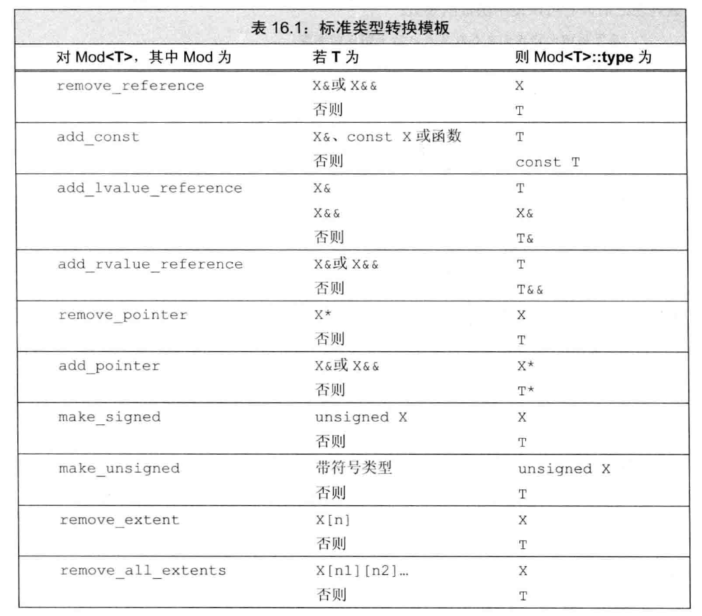

PART 3 类设计者的工具

# 13 拷贝控制
一个类通过定义五种特殊成员函数来控制操作
1. 拷贝构造函数
2. 拷贝赋值运算符
3. 自动构造函数
4. 移动赋值运算符
5. 析构函数

## 13.1 拷贝、赋值与销毁

### 13.1.1 拷贝构造函数
如果一个构造函数的第一个参数是自身类类型的引用，且任何额外参数都有默认值，则此构造函数是拷贝构造函数
```cpp
class Foo{
    public:
        Foo();
        Foo(const Foo&);
}
```
拷贝构造函数的第一个参数必须是一个引用类型
- 合成拷贝构造函数
    - 对某些类来说，合成拷贝构造函数用来阻止我们拷贝该类类型的对象
    - 一般情况下，合成的拷贝构造函数会将其参数的成员逐个拷贝到正在创建的对象中
        - 每个成员的类型决定了它如何拷贝
- 拷贝初始化
    - 在以下情况下也会发生
        - 将一个对象作为实参传递给一个非引用类型的形参
        - 从一个返回类型为非引用类型的函数返回一个对象
        - 用花括号列表初始化一个数组中的元素或一个聚合类中的成员
    - 使用标准库容器或是调用其 insert 或 push 成员时，容器会对其匀速进行拷贝初始化
    - 用 emplace 的成员创建的元素都进行直接初始化
- 参数和返回值
    - 拷贝构造函数被用来初始化非引用类类型参数
- 拷贝初始化的限制
- 编译器可以绕过拷贝构造函数
    - 在初始化工程中，编译器可以但不是必须跳过/移动构造函数，直接创建对象

### 13.1.2 拷贝赋值运算符
- 重载赋值运算符
    - 本质为函数，名字由 operator 关键字后接表示要定义的运算符的符号组成
    - 拷贝赋值运算符接受一个与其所在类相同类型的参数
    - 赋值运算符通常应该返回一个指向其左侧运算对象的引用
- 合成拷贝赋值运算符
    - 如果一个类未定义自己的拷贝赋值运算符，编译器会为它生成一个合成拷贝赋值运算符

### 13.1.3 析构函数
- 构造函数初始化对象的非 static 数据成员，还可能做一些其他工作
- 析构函数释放对象使用的资源，并销毁对象的非 static 数据成员
- 对一个给定类，只会有一个析构函数
- 析构函数完成什么工作
    - 首先执行函数体，然后销毁成员，成员按初始化的逆序销毁
    - 对象最后一次使用之后，不存在类似构造函数中初始化列表的东西来控制成员如何销毁，西沟部分是隐式的，成员销毁时发生什么完全依赖于成员的类型。销毁类类型的成员需要执行成员自己的析构函数，内置类型没有析构函数，因此销毁呢之类型成员什么也不需要做
    - 隐式销毁一个内置指针类型的成员不会 delete 它所指向的对象
- 什么时候会调用析构函数
    - 无论何时一个对象被销毁，就会自动调用其析构函数
        - 变量在离开其作用域时被销毁
        - 当一个对象被销毁时，其成员被销毁
        - 容器（无论是标准库容器还是数组）被销毁时，其元素被销毁
        - 对于动态分配的对象，当对指向它的指针应用 delete 运算符时被销毁
        - 对于临时对象，当创建它的完整表达式结束时被销毁
    - 当指向一个对象的引用或指针离开作用域时，析构函数不会执行
- 合成析构函数
    - 可以用来阻止该类型的对象被销毁
    - 析构函数是作为成员销毁步骤之外的另一部分而进行的


### 13.1.4 三/五法则
- 需要析构函数的类也需要拷贝和赋值操作
    - 通常，对析构函数的需求要比对拷贝构造函数或赋值运算符的需求更为明显，如果这个类需要一个析构函数，我们几乎可以肯定它也需要一个拷贝构造函数和一个拷贝赋值运算符
- 需要拷贝操作的类也需要赋值操作，反之亦然

### 13.1.5 使用 =default
可以通过将拷贝成员定义为 =default 来显式的要求编译器生成合成的版本
- 只能对具有合成版本的成员函数使用 = default

### 13.1.6 阻止拷贝
- 大多数类应该定义默认构造函数、拷贝构造函数和拷贝赋值运算符，无论是隐式地还是显式地
- 定义删除的函数
    - 可以通过将拷贝构造函数和赋值运算符定义为删除的函数来阻止拷贝
    - 虽然声明了它们，但不能以任何方式使用它们，在函数的参数列表后面加上 =delete 来指出我们希望它定义为删除的
    - = default 必须出现在函数第一次声明的时候
    - 可以对任何函数指定 =delete
- 析构函数不能是删除的成员
    - 对于析构函数已删除的类型，不能定义该类型的变量或释放指向该类型动态分配对象的指针
- 合成的拷贝控制成员可能是删除的
    - 如果类的某个成员的析构函数是删除的或不可访问的，则类的合成析构函数被定义为删除的
    - 如果类的某个成员的拷贝构造函数是删除的或不可访问的，则类的合成拷贝构造函数被定义为删除的，如果类的某个成员的析构函数是删除的或布克访问的，则类合成的拷贝函数也被定义为删除的
    - 如果类的某个成员的拷贝赋值运算符是删除的或布克访问的，或是类由一个 const 的或引用成员，则类的合成拷贝赋值运算符被定义为删除的
    - 如果类的某个成员的析构函数是删除的或不可访问的，或是类有一个引用成员，他没有类内初始化器，或是类由一个 const 成员，他没有类内初始化器且其类型未显式定义默认构造函数，则该类的默认构造函数被定义为删除的
- 如果一个类有数据成员不能默认构造、拷贝、复制或销毁，则对应的成员函数将被定义为删除的
- private 拷贝控制
    - 在新标准发布之前，类是通过将其拷贝构造函数和拷贝赋值运算符声明为 private 的来阻止拷贝


## 13.2 拷贝控制和资源管理
一般存在两种拷贝语义
- 可以定义拷贝操作，使类的行为看起来像一个值或者像一个指针

### 13.2.1 行为像值的类
为了提供类值的行为，对于类管理的资源，每个对象都应该拥有一份自己的拷贝
- 定义一个拷贝构造函数，完成 string 的拷贝，而不是拷贝指针
- 定义一个析构函数来释放 string
- 定义一个拷贝赋值运算符来释放对象当前的 string，并从右侧运算对象拷贝 string
```cpp
class HsaPtr {
    public:
        HasPtr(const std::string &s = std::string()): ps(new std::string(s)), i(0) {}
        HstPtr(const HasPtr &p): ps(new sdt::string(*p.ps)), i(p,i) {}
        HasPtr& operator=(const HsaPtr &);
        ~HasPtr() {delete ps;}
    private:
        std::string *ps;
        int i;
};
```

- 类值拷贝赋值运算符
    ```cpp
    HasPtr& HasPtr::operator=(const HasPtr &rhs){
        auto newp = new string(*rhs.ps);
        delete ps;
        ps = newp;
        i = rhs.i;
        return *this;
    }
    ```

- 赋值运算符
    - 如果将一个对象赋予它自身，赋值运算符必须能正确工作
    - 大多数赋值运算符组合了析构函数和拷贝构造函数的工作
对于一个赋值运算符来说，正确工作是非常重要的，即使是将一个对象赋予它自身，也要能正确工作，一个好的方法是在销毁左侧运算对象资源之前拷贝右侧运算对象

### 13.2.2 定义行为像指针的类
对于行为类似指针的类，我们需要为其定义拷贝构造函数和拷贝赋值运算符，来拷贝指针成员本身而不是它指向的 string  
希望直接管理资源时使用引用计数
- 引用计数
    - 除了初始化对象外，每个构造函数(拷贝构造函数除外)还要创建一个引用计数，用来记录有多少对象与正在创建的对象共享状态，当我们创建一个对象时，只有一个对象共享状态，因此将计数器初始化为1
    - 拷贝构造函数不分配新的计数器，而是拷贝给定对象的数据成员，包括计数器。拷贝构造函数递增共享的计数器，指出共享状态的用户少了一个，如果计数器变为0，则析构函数释放状态
    - 析构函数递减计数器，指出共享状态的用户少了一个，如果计数器变为0，则析构函数释放状态
    - 拷贝赋值运算符递增右侧运算对象的计数器，递减左侧运算对下国内的计数器，如果左侧运算对象的计数器变为0，意味着他的共享状态没有用户了，拷贝赋值运算符就必须销毁状态
    - 将引用计数器保存在动态内存中，当创建一个对象时，我们也分配一个新的计数器，当拷贝或赋值对象时，我们拷贝指向计数器的指针，使用这种方法，副本和原对象都会指向相同的计数器
- 定义一个使用引用计数的类
    ```cpp
    class HasPtr{
        public:
            HasPtr(const std::string &s = std::string()): 
                ps(new std::string(s)), i(0), use(new std::size_t(1)) {}
            HasPtr(const HasPtr &p):
                ps(p.ps), i(p.i), use(p.use) { ++*use;}
            HasPtr& operator=(const HstPtr&);
            ~HasPtr();
        private:
            std::string *ps;
            int i;
            std::size_t *use;
    };
    ```
- 类指针的拷贝成员"篡改"引用计数
    - 析构函数应该递减引用函数，指出共享 string 的对象少了一个，如果计数器变为0，则析构函数释放 ps 和 use 指向的内存
    - 处理自赋值问题
        ```cpp
        HasPtr& HasPtr::operator=(const HasPtr &rhs){
            ++*rhs.use;
            if (--*use == 0){
                delete ps;
                delete use;
            }
            ps = rhs.ps;
            i = rhs.i;
            use = rhs.use;
            return *this;
        }
        ```

## 13.3 交换操作
除了定义拷贝控制成员，管理资源的类通常还定义一个名为 swap 的函数，对于与重排元素顺序的算法一起使用的类，会在交换两个原不俗时调用 swap  
如果一个类自定义了自己的 swap ，那么算法将使用类自定义版本
- 编写我们自己的 swap 函数
    ```cpp
    class HasPtr {
        friend void swap(HasPtr&, HasPtr&);
    };
    inline
    void swap(HasPtr &lhs, HsaPtr &rhs){
        using std::swap;
        swap(lhs.ps, rhs.ps);
        swap(lhs.i, rhs.i);
    }
    - 与拷贝控制成员不同，swap 并不是必要的，但是对于分配了资源的类，定义 swap 可能是一种很重要的优化手段
- swap 函数应该调用 swap，而不是 std::swap
- 在赋值运算符中使用 swap
    - 定义 swap 的类通常用 swap 来定义它们的赋值运算符，使用了一种名为拷贝并交换的计数
    ```cpp
    // rhs 按照值传递，意味着 HasPtr 的拷贝构造函数
    // 将右侧运算对象中的 string 拷贝到 rhs
    HasPtr& HasPtr::operator=(HasPtr rhs){
        // 交换左侧运算对象和局部变量rhs 的内容
        swap(*this,rhs); // rhs 现在指向本对象曾经使用的内存
        return *this; // rhs 被销毁，从而 delete 了 rhs 中的指针
    }
    ```
    - 使用拷贝和交换的赋值运算符自动就是异常安全的，且能正确处理自赋值

## 13.4 拷贝控制实例
拷贝赋值运算符通常执行拷贝构造函数和析构函数中也要做的工作，这种情况下，公共的工作应该放在 private 的工具函数中完成
- message 类
- save 和 remove 成员
- message 类的拷贝控制成员
- message 的析构函数
- message 的拷贝赋值运算符
- message 的 swap 函数

## 13.5 动态内存管理类
某些类需要在运行时分配可变大小的内存空间，这种类通常可以使用标准库容器来保存他们的数据
- StrVec 类的设计
    - 每个 StrVec 有三个指针成员指向其元素所使用的内存
        - elements 指向分配的内存中的首元素
        - first_free 指向最后一个实际元素之后的位置
        - cap 指向分配的内存末尾之后的位置
    - alloc 静态成员 四个工具函数
        - alloc_n_copy 分配内存拷贝一个给定范围中的元素
        - free 销毁构造的元素并释放内存
        - chk_n_alloc 保证 StrVec 至少有容纳一个新元素的空间，如果没有添加新元素， chk_n_alloc 会调用 reallocate 来分配更多内存
        - reallocate 在内存用完时为 StrVec 分配新内存
- StrVec 类定义
- 使用 construct
    - 使用 allocator 分配内存时，内存是未构造的
- alloc_n_copy 成员
- free 成员
- 拷贝控制成员
- 在重新分配内存的过程中移动而不是拷贝元素
    - 拷贝后如果每个 string 只有唯一的用户，即可避免拷贝元素
- 移动构造函数和 std::move
    - 一些标准库定义了移动构造函数
    - move 标准库函数
        - 定义在 utility 头文件中
- reallocate 成员

## 13.6 对象移动
标准库容器、string 和 shared_ptr 类既支持移动也支持拷贝，IO 类和 unique_ptr 类可以移动但不能拷贝

### 13.6.1 右值引用
必须绑定到右值的引用，通过 && 而不是 & 来引用  
只能绑定到一个将要销毁的对象，可以自由的将一个右值引用资源移动到另一个对象
- 返回左值的表达式
    - 返回左值医用的函数，连同赋值、下标、解引用和前置递增/递减运算符
- 返回右值的表达式
    - 返回非引用类型的函数，联通算数，关系，位以及后置递增/递减运算符
    - 不能将一个右值引用绑定到这类表达式上，但可以将一个 const 的左值引用或者一个右值引用绑定到这类表达式
- 左值持久；右值短暂
    - 左值有持久的状态，右值要么是字面常量，要么是表达式求值过程中创建的临时对象
    - 右值引用只能绑定到临时的对象即
        - 所引用的对象将要被销毁
        - 该对象没有其他用户
    - 使用右值引用的代码可以自由的接管所引用的对象的资源
    - 右值引用指向将要被销毁的对象，因此，我们可以从绑定到右值引用的对象窃取状态
- 变量是左值，因此我们不能将一个右值引用直接绑定到一个变量上，即使这个变量是右值引用类型也不行
- 标准库 move 函数
    - 可以显使的将一个左值转换为对应的右值引用类型
    - 调用 move 函数来获得绑定到左值上的右值引用
        eg `int &&rr3 = std::move(rr1);`
    - 在调用 move 后，不能对移后源对象的值做任何假设
    - 可以销毁一个移后源对象，也可以赋予它新值，但不能使用一个移后源对象的值
    - 使用 move 不提供 using 声明，直接嗲用 `std::move` 而不是 move

### 13.6.2 移动构造函数和移动赋值运算符
为了让自己的类型支持移动操作，需要为其定义移动构造函数和移动赋值运算符  
```cpp
StrVec::StrVec(StrVec &&s) noexcept : elements(s.elements), first_free(s.first_free), cap(s.cap) {
    s.elements = s.first_free = s.cap = nullptr;
}
```
noexcept 通知标准库我们的构造函数不抛出任何一场
- 移动操作、标准库容器和异常
    - noexcept 承诺不会抛出异常
    - 必须在类头文件的声明和定义(如果定义在类外的话)中都指定 noexcept
    - 不抛出异常的移动构造函数和移动赋值运算符必须标记为 noexcept
    - 避免在移动过程中出现错误导致数据异常，若未声明不会抛出异常，就会使用拷贝构造函数而不是移动构造函数
- 移动赋值运算符
    ```cpp
    StrVec &StrVec::operator=(StrVec &&rhs) noexcept{
        if(this != &rhs){
            free();
            elements = rhs.elements;
            first_free = rhs.first_free;
            cap = rhs.cap;
            rhs.elements = rhs.first_free = rhs.cap = nullptr;
        }
        return *this
    }
    ```
    - 需要能处理自赋值
    - 不能再使用右侧运算对象的资源之前就释放左侧运算对象的资源
- 移后源对象必须可析构
    - 当我们编写一个移动操作时，必须确保移后源对象进入一个可析构的状态
    - 在移动操作之后，移后源对象必须保持有效的，可析构的状态，但是用户不能对其=值进行任何假设
- 合成移动操作
    - 编译器不会为某些类合成移动操作
    - 只有当一个类没有定义任何自己版本的拷贝控制成员，且类的每个非 static 数据成员都可以移动时，编译器才会为它合成移动构造函数或移动赋值运算符
    - 移动操作永远不会隐式定义为删除的函数
    - 定义了一个移动构造函数或移动赋值运算符的类必须也定义自己的拷贝操作，否则这些成员默认地被定义为删除的
- 移动右值，拷贝左值
    - 如果一个类既有移动构造函数，也有拷贝构造函数，编译器使用普通的函数匹配规则来确定使用哪个构造函数
- 如果没有移动构造函数，右值也被拷贝
    - 如果一个类没有移动构造函数，函数匹配规则保证该类型的对象会被拷贝，即使我们试图通过调用 move 来移动也是如此
- 拷贝并交换赋值运算符和移动操作
    ```cpp
    class HasPtr{
    public:
        //添加的移动构造函数
        HasPtr(HasPtr &&p) noexcept : ps(p.ps),i(p.i) {p.ps = 0;}
        //赋值运算符既是移动赋值运算符，也是拷贝赋值运算符
        HasPtr& operator=(HasPtr rhs) {
            swap(*this, rhs); return *this;
        };
    }
    ```
- Message 类的移动操作
    - 移动赋值运算符必须销毁左侧运算对象的旧状态
- 移动迭代器
    - 一个移动迭代器通过改变给定迭代器的解引用运算符行为来适配次迭代器
    - 一般来说一个迭代器的解引用运算符返回一个指向元素的左值，而移动迭代器解引用运算符生成一个右值引用
    - 通过调用标准库的 make_move_iterator 函数将一个普通迭代器其转换为一个移动迭代器
    - 原迭代器的所有操作在移动迭代器中都照常工作
    - 特别的，可以将移动爹大气传递给 uninitialized_copy

### 13.6.3 右值引用和成员函数
区分移动和拷贝的重载函数通常有一个版本接受一个 const T&，而另一个版本接受一个 T&&
- 右值和左值引用成员函数
    - 强制左侧运算对象是一个左值，在参数列表后放置一个引用限定符
    - 引用限定符可以是 & 或 &&，分别指出 this 可以指向一个左值或右值
    - 只能用于非 static 成员函数，且必须同时出现在函数的声明和定义中
    - 对于 & 限定的函数只能用于左值
    - 对于 && 限定的函数只能用于右值
    - 一个函数可以同时用 const 和引用限定，引用限定符跟随在 const 限定符之后
- 重载和引用函数
    - 引用限定符也可以区分重载版本
    - 如果一个成员函数有引用限定符，则具有相同参数列表的所有版本都必须有引用限定符


# 14 重载运算与类型转换

## 14.1 基本概念
重载的运算符是具有特殊名字的函数: 它们的名字由关键字 operator 和其后要定义的运算符号共同组成。和其他函数一样，重载的运算符也包含返回类型、参数列表以及函数体  
除了重载函数的调用运算符 operator() 之外，其他重载运算符不饿能含有默认参数  
当一个重载的运算符是成员函数时，this 绑定到左侧运算对象。成员运算符函数的显式参数数量比运算对象的数量少一个  
对于一个运算符函数来说，它或者是类的成员或者至少含有一个类类型的参数  
只能重载已有的运算符，无权发明新的运算符
不可以被重载的运算符  (:: .* . ?:)
- 直接调用一个重载的运算符函数
    - 通常情况下，我们将运算符作用域类型正确的实参，从而以这种间接方式调用重载运算符函数
        ```cpp
        data1 + data2;
        operator+(data1, data2);
        ```
- 某些运算符不应该被重载
    - 某些运算符指定了运算对象求值的顺序。因为使用重载的运算符本质上是一次函数调用，这些关于运算对象求值顺序的规则无法应用到重载的运算符上
        -  特别的，逻辑与运算符、逻辑或运算符和逗号运算符的运算求值顺序规则无法保留
        -  && 和 || 运算符的重载版本也无法保留内置运算符的短路求值属性，两个运算对象总是会被求值
        -  通常情况下，不应该重载逗号、取地址、逻辑与和逻辑或运算符
- 使用与内置类型一致的含义
    - 如果类执行 IO 操作，则定义移位运算符使其与内置类型的 IO 保持一致
    - 如果类的某个操作是检查相等性，则定义 operator==; 如果类有了 operator==，意味着它通常也应该有 operator!=
    - 如果类包含一个内在的单序比较操作，则定义 operator<; 如果类有了 operator<, 则它应该含有其他关系操作
    - 重载运算符的返回类型通常情况下应该与其内置版本的返回类型兼容: 逻辑运算符和关系u你算符应该返回 bool, 算数运算符应该返回 bool，算数运算符应该返回一个类类型的值，赋值运算符和符合赋值运算符则应该返回运算对象的一个引用
- 赋值和复合赋值运算符
    - 赋值之后，左侧运算对象和右侧运算对象的值相等，并且于是运算符应该返回它左侧运算对象的一个引用
    - 如果类含有算数运算符或者位运算符，则最好也提供对应的赋值运算符
- 选择作为成员或者非成员
    - 当我们定义重载的运算符时，必须首先决定是将其声明为类的成员函数还是声明为一个普通的非成员函数
    - 抉择定义为成员函数还是普通的非成员函数
        - 赋值(=)、下标、调用和成员访问箭头运算符必须是成员
        - 符合赋值运算符一般来说成员，但并非必须，这一点与赋值运算符略有不同
        - 改变对象状态的运算符或者与给定类型密切相关的u你算符，如递增、递减和解引用运算符，通常应该是成员
        - 具有对称性的运算符可能转换任意一端的运算对象，例如算数、相等性、关系和位运算符等，因此它们通常应该是一些普通的非成员函数


## 14.2 输入和输出运算符

### 14.2.1 重载输出运算符 <<
通常情况下，输出运算符的第一个形参是一个非常量 ostream 对象的引用，之所以 ostream 时非常量是因为流写入内容会改变其状态  
第二个形参是一个常量的引用
- 输出运算符尽量减少格式化操作
    - 令输出运算符尽量减少格式化操作可以使用户有权控制输出的细节
    - 通常，输出运算符应该主要负责打印对象的内容而非控制格式，输出运算符不应该打印换行符
- 输入输出运算符必须是非成员函数
    - 与 iostream 标准库兼容的输入输出运算符必须是普通的非成员函数，而不能是类的成员函数，否则它的左侧运算对象将是我们的类的一个对象

### 14.2.2 重载输入运算符 >>
通常情况下第一个形参使运算符将要读取的流的引用  
第二个形参是将要读入到(非常量)对象的引用  
输入运算符必须处理输入可能失败的情况，而输出运算符不需要
- 输入时的错误
    - 可能发生的错误
        - 当流含有错误类型的数据时读取操作可能失败
        - 当读取操作到达文件末尾或者遇到输入流的其他错误时也会失败
    - 当读取操作发生错误时，输入运算符应该负责从错误中恢复
- 标识错误

## 14.3 算数和关系运算符
通常情况下，把算数运算符定义成非成员函数以允许对左侧或右侧的运算对象进行转换  
如果同时定义了算数运算符和相关的复合赋值运算符，则通常情况下应该使用复合赋值来实现算术运算符

### 14.3.1 相等运算符
设计准则
- 如果一个类含有判断两个对象是否相等的操作，则它显然应该把函数定义成 operator== 而非一个普通的命名函数
- 如果类定义了 operator== ，则该运算符应该能判断一组给定对象中是否含有重复数据
- 通常情况下，相等运算符应该具有传递性
- 如果类定义了 operator==，则这个类也应该定义 operator!= 
- 相等运算符和不相等运算符中的一个应该把工作委托给另一个
- 如果某个类在逻辑上有相等性的含义，则该类应该定义 operator==，这样做可以使得用户过呢更容易使用标准库算法来处理这个类
  
### 14.3.2 关系运算符
通常情况下关系运算符应该
1. 定义顺序关系，令其与关联容器中对关键字的要求一致
2. 如果类同时也含有 == 运算符的话，则定义一种关系令其与 == 保持一致，特别是，如果两个对象是 != 的，那么一个对象应该 < 另一个

如果存在唯一一种逻辑可靠的 < 定义，则应该考虑为这个类定义 < 运算符，如果类同时还包含 == ，则当且仅当 < 的定义和 == 产生的结果一致时才定义 < 运算符 


## 14.4 赋值运算符
类也可以定义其他赋值运算符以使用别的类型作为右侧运算对象  
为了与内置类型的运算符保持一致，这个新的赋值运算符将返回其左侧运算对象的引用  
可以重载赋值运算符，不论形参的类型时什么，赋值运算符都必须定义为成员函数
- 复合赋值运算符
    - 赋值运算符必须定义成类的成员，复合赋值运算符通常情况下也应该这样做，这两类运算符都应该返回左侧运算对象的引用

## 14.5 下标运算符
定义下标运算符 operator[]  
下标运算符必须是成员函数  
如果一个类包含下标运算符，则它通常会定义两个版本: 一个返回普通引用，另一个是类的常量成员并且返回常量引用

## 14.6 递增和递减运算符
定义递增和递减运算符的类应该同时定义前置版本和后置版本，这些运算符通常应该被定义成类的成员
- 定义前置递增/递减运算符
    - 为了与内置版本保持一致，前置运算符应该返回递增或递减后对象的引用
- 区分前置和后置运算符
    - 后置版本接受一个额外的(不被使用)int 类型的形参，当我们使用后置运算符时，编译器为这个形参提供一个值为0的实参
    - 为了与内置版本保持一致，后置运算符应该返回对象的原值(递增或递减之前的值)，返回的形式是一个值而非引用
    - 对于后置版本，在递增对象之前需要首先记录对象的状态
    - 不会用到 int 形参，所以无须为其命名
- 显式地调用后置运算符
    ```cpp
    StrBlobPtr p(a1);
    p.operator++(0); //调用后置版本的 operator++
    p.operator++(); //调用前置版本的 operator++
    ```

## 14.7 成员访问运算符
箭头运算符必须是类的成员，解引用运算符通常也是类的成员，尽管非必须如此
- 对箭头运算符返回值的限定
    - 当我们重载箭头时，可以改变的是箭头从哪个对象中获取成员，而箭头获取成员这一事实则永远不变
- point-> mem 的执行过程
    - 如果 point 是指针，则我们应用内置的箭头运算符，表达式等价于(*point).mem
    - 如果 point 是定义了 operator-> 的类的一个对象，则我们使用 point.operator->()的结果来获取 mem
- 重载的箭头运算符必须返回类的指针或者自定义了箭头运算符的某个类的对象


## 14.8 调用函数运算符
函数调用运算符必须是成员函数。一个类可以定义多个不同版本的调用运算符 ，相互之间应该在参数数量或类型上有所区别  
如果类定义了调用运算符，则该类的对象称作函数对象，因为可以调用这种对象，所以我们说这些类的行为像函数一样  
- 含有状态的函数对象类
    - 和其他类一样，函数对象类除了 operator() 之外也可以包含其他成员，函数对象类通常含有一些数据成员，这些成员被用于定制调用运算符中的操作
    - 这两个形参的默认实参分别是 cout 和空格，只有的调用运算符使用这些成员协助其打印给定的 string
    - 函数对象常常作为泛型算法的实参


### 14.8.1 lambda 是函数对象
当我们编写一个 lambda 后，编译器将该表达式翻译成一个未命名对象，在 lambda 后，编译器将该表达式翻译成一个未命名类的未命名对象，在 lambda 表达式产生的类中含有一个重载的函数调用运算符  
因此在默认情况下，由 lambda 产生的类当中的调用运算符是一个 const 成员函数  
用这个类替代 lambda 表达式后，我们可以重写并重新调用 stable_sort
- 表示 lambda 及相应捕获行为的类
    - lambda 表达式产生的类不含默认构造函数、赋值运算符和默认析构函数；是否含有默认的拷贝/移动构造函数则通常要视捕获的数据成员类型而定

### 14.8.2 标准库定义的函数对象
functional 头文件
||||
|---|---|---|
|**算数**|**关系**|**逻辑**|
|plus<Type>|equal_to<Type>|logical_and<Type>|
|minus<Type>|not_equal_to<Type>|logical<Type>|
|multiplies<Type>|greater<Type>|logical<Type>|
|divides<Type>|greater_equal<Type>||
|modulus<Type>|less<Type>||
|negate<Type>|less_equal<Type>||

- 在算法中使用标准库函数对象
    - 表示运算符的函数对象类常用来替换算法中的运算符
    - greater 类型的对象将产生一个调用运算符并负责执行待排序类型的大于运算
    - 也可以作用于指针

### 14.8.3 可调用对象于 function
函数、函数指针、lambda 表达式、bind 创建的对象以及重载了函数调用运算符  
两个不同类型的可调用对象却可能共享同一种调用形式  
调用形式指明了返回的类型
- 不同类型可能具有相同的调用形式
    - 定义一个函数表用于存储指向这些可调用对象的指针，当程序需要执行某个特定的操作时从表中查找该调用函数
- 标准库 function 操作
    1. function<T> f;  f是一个用来存储可调用对象的空 function ，这些可调用对象的调用形式应该与函数类型 T 相同
    2. function<T> f(nullptr); 显式地构造一个空 function
    3. function<T> f(obj); 在 f 中存储可调用对象 obj 地副本
    4. f 将 f 作为条件: 当 f 含有一个可调用对象时为真；否则为假
    5. f(args) 调用 f 中对象，参数是 args
- 定义为 function<T> 的成员的类型
    1. result_type 该 function 类型的可调用对象返回的类型
    2. argument_type 
        first_argument_type 
        second_argumnet_type
        当 T 由一个或连个实参时定义的类型，如果 T 只有一个实参，则 argument_type 是该类型的同义词: 如果 T 有两个实参，则 first_argument_type 和 second_argument_type 分别代表两个实参的类型
- 调用形式  `function<int(int, int)>`
- 重载的函数与 function
    - 不能直接将重载函数的名字存入 function 类型的对象中
    - 通过存储函数指针而非函数名字 或使用 lambda 消除二义性

## 14.9 重载、类型转换与运算符
转换构造函数和类型转换运算符共同定义了类类型转换，这样的转换有时也被称作用户定义的类型转换  

### 14.9.1 类型转换运算符
类型转换运算符是类的一种特殊成员函数 ，负责将一个类类型的值转换成其他类型  
`operator type() const;`
类型转换运算符既没有显式的返回类型，也没有形参，而且必须定义成类的成员函数。  
- 一个类型转换函数必须是类的成员函数；它不能声明返回类型，形参列表也必须为空。类型转换函数通常应该是 const
- 定义含有类型转换运算符的类
    - 尽管编译器一次只能执行一个用户定义的类型转换，但是隐式的用户定义类型转换可以置于一个标准(内置)类型转换之前或之后
    - 因为类型转换运算符是隐式执行的，所以无法给这些函数传递实参，当然也就可能在类型转换运算符的定义中使用任何形参
- 类型转换运算符可能产生意外结果
    - 大多数情况类型转换自动发生
- 显式的类型转换运算符
    - 当表达式出现在下列位置时，显式的类型转换将被隐式的执行
        - if、while 及 do 语句的条件部分
        - for 语句头的条件表达式
        - 逻辑非运算符(!)、逻辑或运算符(||)、逻辑与运算符(&&)的运算对象
        - 条件运算符(?:)的条件表达式
- 转换为 bool
    - IO 标准库通过定义一个向 bool 的显式类型转换实现同样的目的
    - 向 bool 的类型准换通常用在条件部分，因此 operator bool 一般定义成 explicit 的

### 14.9.2 避免有二义性的类型转换
两种情况下可能产生多重转换路径
1. 两个类提供相同的类型转换
2. 类定义了多个转换规则
通常情况下，不要为类定义相同的类型转换，也不要再类中定义两个及两个以上转换源或准换目标是算术类型的转换
- 实参匹配和相同的类型转换
    - 如果确实想要执行上述调用，就不得不显式地调用类型转换运算符或者转换构造函数
- 二义性与转换目标为内置类型的多重类型转换
    - 定义了一组类型转换，他们的转换源类型本身可以通过其他类型中转换联系在一起，则同样会产生二义性问题
    - 党委偶们使用两个用户定义的类型转换时，如果转换函数之前或之后存在标准类型转换，则标准类型转换将决定最佳匹配到底是哪个
- 重载函数与构造转换函数
    - 如果在调用重载函数时我们需要构造函数或者强制类型转换类改变实参的类型，则这通常意味着程序的设计存在不足
- 重载函数与用户定义的类型转换
    - 当调用重载函数时，如果两个用户定义的类型转换都提供了可行匹配，则我们认为这些类型转换一样好，在这个过程中，我们不会考虑任何可能出现的标准类型转换的级别
    - 调用重载函数时，如果需要额外的类型转换，则该转换的界别只有当所有可行函数都请求同一个用户定义的类型转换时才有用，如果所需的用户定义的类型转换不止一个，则该调用具有二义性

### 14.9.3 函数匹配与重载运算符
当我们使用重载运算符作用于类类型的运算对象时，候选函数中包含该运算符的普通非成员版本和内置版本，除此之外如果左侧于是暖对象是类类型，则定义在该类中的运算符的重载版本也包含在候选函数中
- 表达式中运算符的候选函数集既应该包含成员函数，也应该包含非成员函数
- 如果我们对同一个类既提供类转换目标是算术类型的类型转换，也提供了重载的运算符，则将会遇到重载运算符与内置运算符的二义性问题


# 15 面向对象程序设计

## 15.1 OOP: 概述
面向对象程序设计的核心思想是数据抽象、继承和动态绑定
- 继承
    - 通过继承联系在一起的类构成一种层次关系。通常在层次关系的根部有一个基类，其他类则直接或间接地从基类继承而来，这些继承得到的类称为派生类
    - 基类负责定义在层次关系中所有类共同拥有地成员，而每个派生类定义各自特有地成员
    - 基类将类型相关地函数与派生类不做改变直接继承地函数区分对待，对于某些函数，基类希望它的派生类各自定义适合自身的版本，此时基类就将这些函数声明称虚函数
    - 派生类必须通过使用类派生列表明确指出它是从哪个基类继承而来的
        - 冒号后跟逗号分隔的基类列表，其中基类前面可以有访问说明符
        - 允许派生类显式地注明它将使用哪个成员函数改写基类地虚函数，在该函数地形参列表之后增加一个 override 关键字
- 动态绑定
    - 使用动态绑定，能用同一段代码分别处理 Quote 和 Bulk_quote 对象
    - 函数的运行版本由实参决定，即在运行时选择函数的版本，所以动态绑定有时又被陈伟运行时绑定
    - 当使用基类的引用(或指针)调用一个虚函数时将发生动态绑定

## 15.2 定义基类和派生类

### 15.2.1 定义基类
基类通常都应该定义一个虚析构函数，即使该函数不执行任何实际操作也是如此
- 成员函数与继承
    - 派生类可以继承其基类的成员，需要对这些操作提供自己的新定义以覆盖从基类继承而来的旧定义
    - 基类的两种成员
        - 基类希望其派生类进行覆盖的函数
            - 通常定义为虚函数，使用指针或引用调用时，将被同台绑定
        - 基类希望派生类直接继承而不要改变的函数
    - 任何构造函数之外的非静态函数都可以是虚函数
- 访问控制与继承
    - 派生类可以继承定义在基类中的成员，但是派生类的成员函数不一定有权访问从基类继承而来的成员
    - 使用受保护的访问运算符说明基类希望它的派生类有权访问但禁止其他用户访问的成员

### 15.2.2 定义派生类
派生类必须通过实用类派生列表明确指出它是从哪个(哪些)基类继承而来的  
类派生列表的形式是一个冒号，后面紧跟以逗号分隔的基类列表，其中每个基类前面可以又以下三种访问说明符中的一个
- public
- protected
- private

派生类必须将其继承而来的成员函数中需要覆盖的那些重新声明  
访问说明符的作用是控制派生类从基类继承而来的成员是否对派生类的用户可见  
如果一个派生类是公有的，则基类的公有成员也是派生类接口的组成部分，我们能将公有派生类型的对象绑定到基类的引用或指针上

- 派生类中的虚函数
    - 派生类经常（但不总是）覆盖它继承的虚函数，
    - 如果派生类没有覆盖其基类中的某个虚函数，则该虚函数的行为欸死于其他的普通成员，派生类会直接继承其在基类中的版本
    - C++ 11 允许派生类显式地注明它使用某个成员函数覆盖了它继承的虚函数
        - 在形参列表之后，或者 const 成员函数，引用成员函数的引用限定符后添加关键字 override
- 派生类对象及派生类向基类的类型转换
    - 派生类对象组成部分
        - 含有派生类自己定义的非静态成员的子对象
        - 一个与该派生类继承的基类对应的子对象
        - 因为派生类对象中含有与其基类对应的组成部分，所以我们能把派生类的对象当成基类来使用，也能将基类的指针或引用绑定到派生类对象中的基类部分上
    - 转换通常称为派生类到基类的类型转换，编译器会隐式地执行派生类到基类地转换
    - 在派生类对象中含有与其基类对应地组成部分
- 派生类构造函数
    - 派生类也必须使用类地构造函数来初始化它地基类部分
    - 每个类控制它自己的成员初始化过程
    - 除非指出，否则派生类会像数据成员一样执行默认初始化，
    - 如果想使用其他的基类构造函数，需要以类名加圆括号的实参列表的形式为构造函数提供初始值
    - 首先初始化基类的部分，然后按照声明的顺序依次初始化派生类的成员
- 派生类使用基类的成员
    - 派生类可以访问基类的公有成员和受保护成员
    - 派生类的做由于嵌套在基类的作用域中
- 继承与静态成员
    - 如果基类定义类一个静态成员，则在整个继承体系中只存在该成员的唯一定义。无论基类派生出多少个派生类，对于每个静态成员来说都只存在唯一的实例
- 派生类的声明
    - 声明中包含类名但是不包含它的派生列表
        ```cpp
        class Buld_quote : public Quote; // 错误
        class Buld_quote; // 正确
        ```
- 被用作基类的类
    - 如果想将某个类用作基类，则该类必须已经定义而非仅仅声明
    - 一个类不能派生它自己
    - 可以派生派生类，直接基类，间接基类
    - 最终的派生类将包含他的直接积累的子对象和每个间接基类的子对象
- 防止继承的发生
    - 在类名后跟一个关键字 `final` 防止继承的发生


### 15.2.3 类型转换与继承
存在继承关系的类是一个例外，
可以将积累的指针或引用绑定到派生类对象上  
当使用基类的引用或指针时，实际上我们并不清楚该引用或指针所绑定对象的真实类型  
与内置指针一样，智能指针类也支持派生类向基类的类型转换，可以将一个派生类对象的指针存储在一个基类的智能指针中
- 静态类型与动态类型
    - 当存在继承关系的类型时，必须将一个变量或其他表达式的静态类型与该表达式表示对象的动态类型区分开来
    - 静态类型在编译时总是已知的，动态类型则是变量或表达式的内存中的对象的类型，直到运行时才可知
    - 基类的指针或引用的动态类型可能与其动态类型不一致
- 不存在基类向派生类的隐式转换
    - 如哦已知某个基类向派生类的转换是安全的，则可以使用 static_cast 来强制覆盖掉编译器的检查工作
- 在对象之间不存在的类型转换
    - 派生类向基类的自动转换只对指针或引用类有效，在派生类类型和基类类型之间不存在这样的转换
    - 当用一个派生类对象为一个基类对象初始化或赋值时，只有该派生类对象中的基类部分会被拷贝、移动或赋值，它的派生类部分将被忽略掉
  
## 15.3
- 对虚函数的调用可能在运行时才被解析
    - 当某个虚函数通过指针或引用调用时，编译器产生的代码知道运行时才能确定应该调用哪个版本的函数，被调用的函数是与绑定到指针或引用上的对象的动态类型相匹配的那一个
    - 动态绑定只有当我们通过指针或调用虚函数时才会发生
- 派生类中的虚函数
    - 当我们在派生类中覆盖了某个虚函数时，可以再一次使用 virtual 关键字指出该函数的性质
    - 一个派生类的函数如果覆盖了某个继承而来的虚函数，则它的形参类型必须与被它覆盖的基类函数完全一致
    - 派生类中虚函数的返回类型也必须与基类函数匹配，当类的虚函数返回类型是类本身的指针或引用时，该规则无效
    - 基类中的虚函数再派生类中隐含地也是一个虚函数，当派生类覆盖了某个虚函数时，该函数再基类中地形参必须与派生类中的形参严格匹配
- final 和 override 说明符
    - 派生类如果定义了一个函数与基类中虚函数的名字相同但是形参列表不同，这仍然合法，编译器将认为新定义的这个函数与基类中原有的函数是相互独立的
    - C++ 11 新标准中可以使用 override 关键字来说明派生类中的虚函数
    - 将函数定义成 final 或任何尝试覆盖该函数的操作都将引发错误
    - final 和 override 说明符出现在形参列表（包括任何 const 或引用修饰符）以及尾置返回类型之后
- 虚函数与默认实参
    - 如果通过基类的引用或指针调用函数，则使用基类中定义的默认实参，即使实际运行的是派生类中的函数版本也是如此
    - 如果虚函数使用默认实参，则基类和派生类中定义的默认实参最好一致
- 回避虚函数的机制
    - 在某些情况下，希望对虚函数的调用不要进行动态绑定，而是强迫其执行虚函数的某个特定版本，使用作用域运算符实现
        ```cpp
        double undiscounted = baseP -> Quote::net_price(42);
        // 强行调用基类中定义的函数版本而不管 baseP 的动态类型到底是什么
        ```
    - 通常情况下，只有成员函数（或友元）中的代码才需要使用作用域运算符来回避虚函数的极值
    - 当一个派生类的虚函数调用它覆盖的基类的虚函数版本是，需要回避虚函数的调用机制
    - 如果一个派生类虚函数需要调用它的基类版本，但是没有使用作用域运算符，则再运行时掉哦那个将被解析为对派生类版本自身的调用，从而导致无限递归

## 15.4 抽象基类
- 纯虚函数
    - 将函数定义成纯虚函数从而令用户知道该函数没有实际意义
    - 纯虚函数无须定义，通过在函数体的位置书写 =0 就可以将一个虚函数说明为纯虚函数
    - 可以为纯虚函数提供定义，不过函数体必须定义在类的外部，也就是说，不能再类的内部为一个 =0 的函数提供函数体
- 含有纯虚数的类是抽象基类
    - 含有（或者未经覆盖直接继承）纯虚函数的类是抽象基类
    - 抽象基类负责定义接口，而后续的其他类可以覆盖该接口
    - 不能创建抽象基类的对象
- 派生类构造函数只初始化它的直接基类

## 15.5 访问控制与继承
每个类分别控制着其成员对于派生类来说是否可访问
- 受保护的成员
    - 一个类使用 protected 关键字来声明那些它希望与派生类分享但是不想被其他公共访问使用的成员
        - 和私有成员类似，收保护的成员对于类的用户来说是不可访问的
        - 和公有成员类似，受保护的成员对于派生类的成员和友元来说是可访问的
        - 派生类的成员或友元只能通过派生类对象来访问基类的受保护成员，派生类对于一个基类对象中的受保护成员没有任何访问特权
    - 派生类的成员和友元只能访问派生类对象中的基类部分的受保护成员，对于普通的基类成员不具有特殊的访问权限
- 公有、私有和受保护继承
    - 某个类对其继承而来的访问权限受到两个因素影响
        - 在基类中该成员的访问说明符
        - 派生类的派生列表中的访问声明符
    - 派生访问说明符对于派生类的成员(及友元)能否访问其直接基类的成员没什么影响
    - 对基类成员的访问全写只与基类中的访问说明符有关
    - 访问说明符还可以集成自派生类的新类的访问权限
- 派生类向基类转换的可访问性
    - 派生类向基类的转换是否可访问由使用该转换的代码决定，同时派生类的派生访问说明符也会有影响，假定 D 继承自 B
        - 只有当 D 公有地继承 B 时，用户代码才能使用派生类向基类地转换
        - 不论 D 以什么方式继承 B，D 的成员函数和友元都能使用派生类向基类的转换；派生类向其直接基类的类型转换对于派生类的成员和友元来说是永远可以访问的
        - 如果 D 继承 B 的方式是公有的或者受保护的，则 D 的派生类的成员和友元可以使用 D 向 B 的类型转换；反之则不能
    - 对于代码中的某个给定节点来说，如果积累的公有成员是可访问的，则派生类向基类转换也是可访问的，反之则不行
- 友元与继承
    - 友元关系不能继承，基类的友元在访问派生类成员时不具有特殊性，派生类的友元也不能随意访问基类的成员
    - 不能继承友元关系；每个类负责控制各自成员的访问权限
- 改变个别成员的可访问性
    - 通过 using 声明可以改变派生类继承的某个名字的访问级别
    - 通过在类的内部使用 using 声明语句，可以将该类的直接或间接基类中的任何可访问成员标记出来
    - using 声明语句中名字的访问权限由该 using 声明语句之前的访问说明符来决定
    - 派生类只能为那些它可以访问的名字提供 using 声明
- 默认的继承保护级别
    - 在使用 struct 关键字和 class 关键字定义的类之间还由更深层次的差别—— 默认成员
    - 一个私有派生的类最好显式的将 private 声明出来，而不要仅仅依赖于默认的设置，显式声明的好处是可以令私有继承关系清晰明了

## 15.6 继承中的类作用域
- 每个类定义自己的作用域，在这个作用域内定义类的成员，当存在继承关系时，派生类的作用域嵌套在其基类的作用域之内
- 如果一个名字在派生类的作用域内无法正确解析，则编译器将继续在外层的基类作用域中寻找该名字的定义
- 在编译时进行名字查找
    - 一个对象、引用或指针的静态类型决定了该对象的哪些成员是可见的，即使静态类型与动态类型可能不一致，但能使用哪些成员仍然是由静态类型决定的
- 名字冲突与继承
    - 派生类也能重用定义在其直接基类或间接基类中的名字，此时定义在内层作用域（即派生类）的名字将定义在外层作用域（即基类）的名字
    - 派生类的成员将隐藏同名的基类成员
- 通过作用域运算符来使用隐藏的成员
    - 除了覆盖继承而来的虚函数之外，派生类最好不要重用其他定义在基类中的名字
- 一如往常，名字查找先于类型检查
    - 声明在内层作用域的函数并不会重载生命在外层作用域的函数，定义在派生类中的函数也不会重载其基类中成员
    - 如果派生类的成员与基类的某个成员同名，则派生类将在其作用域内隐藏该基类成员，即使派生类成员和基类成员的形参列表不一致，基类成员也仍然会被隐藏掉
    - 一旦查找到对应名字，编译器就不再继续查找了
- 虚函数与作用域
    - 派生类中的虚函数必须有相同的形参列表
- 通过基类调用隐藏的虚函数
    - 通过基类的指针进行调用，编译器产生的代码将在运行时确定使用虚函数的哪个版本，判断依据是该指针所绑定对象的真实类型
- 覆盖重载的函数
    - 成员函数无论是否是虚函数都能被重载，派生类可以覆盖重载函数的 0 个或多个实例，如果派生类希望所有的重载版本对于它来说都是可见的，那么就需要覆盖所有版本，或者一个也不覆盖
    - 为重载的成员提供一条 using 声明语句，无须覆盖基类中的每一个重载版本

## 15.7 构造函数与拷贝控制

### 15.7.1 虚析构函数
在基类中将析构函数定义成虚函数以确保执行正确的析构函数版本
只要基类的析构函数是虚函数，就能确保delete 基类指针时将运行正确的析构函数版本
如果基类的析构函数不是虚函数，则 delete 一个指向派生类对象的基类指针将产生未定义的行为
```cpp
class Quote {
public:
    virtual ~Quote() = default;
};
Quote *itemP = new Quote;
delete itemP; //调用 quote 析构函数
itemP = new Buld_quote;
delete itemP; //调用 Bulk_quote 析构函数
```
- 虚析构函数将阻止合成移动操作
    - 基类需要一个虚析构函数这一事实还会对基类和派生类的定义产生另外一个间接的ing想；如果一个类定义了虚析构函数，即使通过 = default 的形式使用了合成的版本，编译器也不会为这个类合成移动操作

### 15.7.2 合成拷贝控制与继承
- 基类或派生类的合成拷贝控制成员的行为与其他合成的构造函数、赋值运算符或析构函数类似
    - 对类本身的成员依次进行初始化、赋值或销毁操作
- 派生类隐式地使用而基类通过将其虚析构函数定义成 =default 而显式地使用
- 对于派生类地析构函数来说，除了销毁派生类自己的成员之外，还负责销毁派生类的直接积累，该直接基类又销毁它自己的直接基类，以此类推至继承链的顶端
- 派生类中删除的拷贝控制与基类的关系 
    - 基类或派生类也能将其合成的默认构造函数或者任何一个拷贝控制成员定义成被删除的函数
    - 某些定义基类的方式也可能导致有的派生类成员被定义成被删除的函数
        - 如果基类中的默认构造函数、拷贝复制运算符或析构函数是被删除的函数或者不可访问，则派生类中合成的默认和拷贝构造函数将是被删除的，原因是编译器不能使用基类成员来执行派生类对象基类部分的构造、赋值或销毁操作
        - 如果在基类中有一个不可访问或删除掉的析构函数，则派生类中合成的默认和拷贝构造函数将是删除的，因为编译器无法销毁派生类对象的基类部分
        - 和过去一样，编译器将不会合成一个删除掉的移动操作，当我们使用 =default 请求一个移动操作时，原因是派生类对象的基类部分不可移动
- 移动操作与继承
    - 大多数基类会定义一个虚析构函数，积累通常不含有合成的移动操作，而且在它的派生类中也没有合成的移动操作
    - 基类缺少移动操作会阻止派生类拥有自己的合成移动操作，需要执行移动操作时应该首先在基类中进行定义
    ```cpp
    class Quote {
    public:
        Quote() = default; //对成员依次进行默认初始化
        Quote(const Quote&) = default; //对成员依次拷贝
        Quote(Quote&&) = default; //对成员依次拷贝
        Quote& operator = (const Quote&) = default; //拷贝赋值
        Quote& operator = (Quote&&) = default; //移动操作
        virtual ~Quote() = default;
    };

### 15.7.3 派生类的拷贝控制成员
派生类的构造函数在其初始化阶段中不但要初始化派生类自己的成员，还负责初始化派生类对象的基类部分  
派生类的拷贝和移动构造函数在拷贝和移动自有成员的同时，也要拷贝和移动基类部分的成员。类似的，派生类赋值运算符也必须为其基类部分的成员赋值  
当派生类定义了拷贝或移动操作时，该操作负责拷贝或移动包括基类部分成员在内的整个对象  
- 定义派生类的拷贝或移动构造函数
    - 当为派生类定义拷贝或移动构造函数时，通常使用对应的基类构造函数初始化对象的基类部分
    - 在默认情况下，基类默认构造函数初始化派生类对象的基类部分，如果我们向拷贝或移动基类部分，则必须在派生类的构造函数初始值列表中显式地使用积累的拷贝或移动构造函数
- 派生类赋值运算符
    - 派生类地赋值运算符也必须显式地为其基类部分赋值
    - 无论基类地构造函数或赋值运算符是自定义地版本还是合成的版本，派生类地对应操作都能使用它们
- 派生类地析构函数
    - 析构函数体执行完成后，对象地成员会被隐式销毁，对象的基类部分也是隐式销毁的
    - 派生类析构函数只负责销毁由派生类自己分配的资源
    - 对象销毁地顺序与创建的顺序相反，派生类析构函数首先执行，然后是积累的析构函数，以此类推，沿着继承体系地反方向直至最后
- 在构造函数和析构函数中调用虚函数
    - 如果构造函数或析构函数调用了某个虚函数，则我们应该执行与构造函数或析构函数所属类型相对应的虚函数版本

### 15.7.4 继承的构造函数
C++ 11 中派生类能够重用其直接基类定义的构造函数  
一个类只初始化它的直接基类  
一个类也只继承其直接积累的构造函数  
派生类继承基类构造函数的方式是提供一条注明了基类名的 using 声明语句  
通常情况下，using 声明语句只是令某个名字在当前作用域内可见，而当作用于构造函数时，using 声明语句将令编译器产生代码  
对于基类的每个构造函数，编译器都生成一个与之对应的派生类构造函数
编译器生成的构造函数形如
`derived(parms) : base(args) { }`
derived 是派生类的名字， base 是基类的名字， parms 是构造函数的形参列表， args 将派生类构造函数的形参传递给基类的构造函数
- 继承的构造函数的特点
    - 一个构造函数的 using 声明不会改变该构造函数的访问级别
    - 当一个基类构造函数含有默认实参时，这些实参并不会被继承
    - 派生类将获得多个继承的构造函数，其中每个构造函数分别省略掉一个含有默认实参的形参
    - 如果派生类定义的构造函数与基类的构造函数具有相同的参数列表，则该构造函数将不会被继承，定义在派生类中的构造函数将替换继承而来的构造函数

## 15.8 容器与继承
当我们使用容器存放继承体系中的对象时，通常必须采取间接存储的方式，因为不允许在容器中保存不同类型的元素，不能把具有继承关系的多种类型的对象直接存放在容器中  
当派生类对象被赋值给基类对象时，其中的派生类部分将被切掉，因此容器和存在继承关系的类型无法兼容  
- 在容器中放置智能指针而非对象
    - 但我们希望在容器中存放具有继承关系的对象时，我们实际上存放的通常是基类的指针（更好的选择是智能指针）

### 15.8.1 编写 Basket 类
定义一个 compare 的私有静态成员，该成员负责比较 shared_ptr 所指的对象的 isbn
```cpp
std::multiset<std::shared_ptr<Quote>, decltype(compare)*> items{compare};
```
- 定义 Basket 的成员
    - 在类的内部定义的 add_item 成员，接受一个指向动态分配的 Quote 的 shared_ptr 然后将这个 shared_ptr 放置在 multiset 中
    - 第二个成员的名字是 total_receipt，它负责将购物篮的内容逐项打印成清单
- 隐藏指针
    - Basket 的用户仍然必须处理动态内存
        ```cpp
        void add_item(const Quote& sale); //拷贝给定的对象
        void add_item(Quote&& sale); //移动给定的对象
        ```
- 模拟虚拷贝
    - 为了解决上述问题，给 Quote 类添加一个虚函数，该函数将申请一份当前对象的拷贝
        ```cpp
        class Quote {
        public:
            virtual Quote* clone() cosnt & {return new Quote(*this);}
            virtual Quote* clone() && {return new Quote(std::move(*this));}
        };
        class Bulk_quote : public Quote {
            Bulk_quote* clone() const & {return new Bulk_quote(*this);}
            Bulk_quote* clone() && {return new Bulk_quote(std::move(*this));}
        };
        ```

## 15.9 文本查询程序再探
- 支持如下查询形式
    - 单词查询，用于得到匹配狗哥给定 string 的所有行
    - 逻辑非查询，使用~运算符得到不匹配查询条件的所有行
    - 逻辑或查询，使用 | 运算符返回匹配两个条件中任意一个的行
    - 逻辑与查询，使用 & 运算符返回匹配全部两个条件的行

### 15.9.1 面向对象的解决方案
应将几种不同的查询建模成相互独立的类，这些类共享一个公共基类
每个类包含两个操作
1. eval，接受一个 TextQuery 对象并返回一个 QueryResult，eval 函数使用给定的 TextQuery 对象查找与之匹配的行
2. rep, 返回基础查询的 string 表示形式，eval 函数使用 rep 创建一个表示匹配结果的 QueryResult，输出运算符使用 rep 打印查询表达式

- 抽象基类
    - 将 eval 和 rep 定位为纯虚数，其他代表某种特定查询类型的类必须覆盖这两个函数
- 将层次结构隐藏于接口类中
    - 定义 Query 对象的三个重载运算符以及一个接受 string 参数的 Query 构造函数，这些函数动态分配一个新的 Query_base 派生类的对象
- 理解这些类的工作机理
  
### 15.9.2 Query_base 类和 Query 类
- Query_base 类
    - 抽象基类
    ```cpp
    class Query_base {
        friend class Query;
    protected:
        using line_no = TextQuery::line_no;
        virtual ~Query_base () = default;
    private:
        virtual QueryResult eval(const TextQuery&) const = 0;
        virtual std::string rep() cosnt = 0;
    };
    ```
- Query 类
    - 对外提供接口，同时隐藏 Query_base 的继承体系，每个 Query 对象都含有一个指向 Query_base 对象的 shared_ptr
    ```cpp
    class Query {
        friend Query operator~(const Query &);
        friend Query operator|(const Query&, const Query&);
        friend Query operator&(const Query&, const Query&);
    public:
        Query(const std::string&);
        QueryResult eval(const TextQuery &t) const { return q->eval(t);}
        std::string rep() cosnt { return q->rep();}
    private:
        Query(std::shared_ptr<Query_base> query) : q(query) {}
        std::shared_ptr<Query_base> q;
    };
    ```
- Query 的输出运算符
    ```cpp
    std::ostream & opeator<<(std::osteam &os, const Query &query){
        return os << query.rep();
    }
    ```

### 15.9.3 派生类
- WordQuery 类
    - 一个 WordQuery 查找一个给定的 string，是在给定的 TextQuery 对象上实际执行查询的唯一一个操作
    ```cpp
    class WordQuery: public Query_base {
        friend class Query;
        WordQuery(const std::string &s): query_word(s) {}
        QueryResult eval(const TextQuery &t) const { return t.query(query_word);}
        std::string rep() cosnt {return query_word; }
        std::string query_word;
    };
    inline
    Query::Query(const std::string &s): q(new WordQuery(s)) {}
    ```
- NotQuery 类及 ~ 运算符
    - ~ 运算符生成一个 NotQuery，其中保存着一个需要对其取反的 Query
    ```cpp
    class NotQuery: public Query_base {
        friend Query operator~(const Query &);
        NotQuery(const Query &q): query(q) {}
        std::string rep() const {return "~(" + query.rep() + ")"}
        QueryResult eval(cosnt TextQuery&) cosnt;
        Query query;
    };
    inline Query operator~(const Query &operand){
        return std::shared_ptr<Query_base>(new NotQuery(operand));
    }
    ```
- BinaryQuery 类
    ```cpp
    class BinarQuery: public Query_base {
        BinaryQuery(const Query &l, const Query &r, std::string s):
            lhs(l), rhs(r), opSym(s) {}
        std::string rep() const { return "(" + lhs.rep() + " " + opSym + " " + rhs.rep() + ")"}
        Query lsh, rhs;
        std::string opSym;
    };
    ```
- AndQuery 类、OrQuery 类及相应的运算符
    ```cpp
    class AndQuery: public BinaryQuery {
        friend Query operator&(cosnt Query&, const Query&);
        AndQuery(const Query &left, const Query &right): BinaryQuery(left, right, "&") {}
        QueryResult eval(const TextQuery&) const;
    };
    inline Query operator&(const Query &lhs, const Query &rhs){
        return std::shared_ptr<Query_base>(new AndQuery(lhs, rhs));
    }
    class OrQuery: public BinaryQuery {
        friend Query operator|(const Query&, const Query&);
        OrQuery(cosnt Query &left, const Query &right): BinaryQuery(left, right, "|") {}
        QueryResult eval(const TextQuery&) const;
    };
    inline Query operator|(cosnt Query &lhs, const Query &rhs){
        return std::shared_ptr<Query_base>(new OrQuery(lhs, rhs));
    }
    ```
### 15.9.4 eval 函数
- OrQuery::eval
    ```cpp
    QueryResult
    OrQuery::eval(const TextQuery& text) const{
        auto right = rhs.eval(text), left = lhs.eval(text);
        auto ret_lines = make_shared<set<line_no>>(left.bergin(), left.end());
        ret_lines->insert(right.begin(), right.end());
        return QueryResult(rep(), ret_lines, left.get_file());
    }
    ```
- AndQuery::eval
    ```cpp
    QueryResult
    AndQuery::eval(cosnt TextQuery& text) const{
        auto left = lhs.eval(text), right = rhs.eval(text);
        auto ret_lines = make_shared<set<line_no>>();
        set_intersection(left.begin(), left.end(), right.begin(), right.end(), inserter(*ret_lines, ret_lines->begin()));
        return QueryResult(rep(), ret_lines, left.get_file());
    }
    ```
    - set_intersection
        - 标准库算法
        - 接受五个迭代器，使用前四个迭代器表示两个输入序列，最后一个实参表示目的位置
        - 该算法将两个输入序列中共同出现的元素写入到目的位置
- NotQuery::eval
    ```cpp
    QueryResult
    NotQuery::eval(cosnt TextQuery& text) const{
        auto result = query.eval(text);
        auto ret_lines = make_shared<set<line_no>>();
        auto beg = result.begin(), end = result.end();
        auto sz = result.get_file()->size();
        for (size_t n = 0; n != sz; ++n){
            if (beg == end || *beg != n)
                ret_lines->insert(n);
            else if (beg != end)
                ++beg;
        }
        return QueryResult (rep(), ret_lines, result.get_file());
    }
    ```

# 16 模板与泛型编程

## 16.1 定义模板

### 16.1.1 函数模板
可以定义一个通用的函数模板，而不是每个类型都定义一个新函数，一个函数模板就是一个公式，可用来针对特定类型的函数版本
```cpp
template<typename T>
int compare(const T &v1, const T &v2){
    if (v1 < v2) return -1;
    if (v1 > v2) return 1;
    return 0;
}
```
模板定义以关键字 template 开始，后跟一个模板参数列表  
在模板定义中，模板参数列表不能为空  
当使用模板时，我们隐式地或显式地指定模板实参，将其绑定到模板参数上
- 实例化函数模板
    - 当调用一个函数模板时，编译器使用实参地类型来确定绑定到模板参数T地类型
    - 编译器用推断出地模板参数来进行实例化一个特定版本的函数
    - 编译器生成的版本通常称为模板的实例
- 模板类型参数
    - 一般来说可以将类型参数看作类型说明符像内置类型或类类型说明符一样使用
    - 类型参数可以用来指定返回类型或函数的参数类型，以及在函数体内用于变量声明或类型转换
- 非类型模板参数
    - 非类型参数表示一个值而非一个类型，通过一个特定的类型名而非关键字 class 或 typename 来指定类型参数
    - 当一个模板被实例化时，非类型参数被一个用户 提供的或编译器推断出地值所代替，这些值必须是常量表达式，从而允许编译器在编译时实例化模板
    - 编译器会在与一个字符串字面常量地末尾插入一个空字符作为终结符
    - 不能用一个普通（非 static）局部变量或动态对象作为指针或引用非类型模板参数地实参
    - 指针参数也可以用 nullptr 或一个值为 0 的常量表达式来实例化
    - 非类型模板参数的模板实参必须是常量表达式
- inline 和 constexpr 的函数模板
    - 函数模板可以声明为 inline 或 constexpr 的
    - inline 或 constexpr 说明符放在模板参数列表之后，返回类型之前
- 编写类型无关的代码
    - 模板中的函数参数是 const 的引用
    - 函数体中的条件判断仅使用 < 比较运算
    - 通过将函数参数设定为 const 的引用，保证了函数可以用于不能拷贝的类型，用于处理大对象时可以运行得更快
    - 如果需要关心类型无关和可移植性，可能需要用 less
        ```cpp
        // 即使用于指针也正确的 compare 版本
        template <typename T> int compare(const T &v1, const T &v2){
            if (less<T>()(v1, v2)) return -1;
            if (less<T>()(v2, v1)) return 1;
            return 0;
        }
        // less<T> 默认实现使用 <, 可能该函数并未起到良好定义的作用
        ```
    - 模板程序应该尽量减少对实参类型的要求
- 模板编译
    - 当编译器遇到一个模板定义时，并不生成代码，只有当我们实例化出模板的一个特定版本时，编译器才会生成代码
    - 为了生成一个实例化版本，编译器需要掌握函数模板或类模板成员函数的定义，与非模板代码不同，模板的头文件通常既包含声明也包含定义
    - 函数模板和类模板成员函数的定义通常放在头文件中
- 大多数编译错误在实例化期间报告
    - 第一阶段 编译模板本身
    - 第二阶段 编译器遇到模板在使用时
    - 第三个阶段是模板实例化时，只有这个阶段才能发现类型相关的错误，依赖于编译器如何管理实例化时，只有这个阶段才能发现类型相关的错误
    - 保证传递给模板的实参支持模板所要求的操作，以及这些操作在模板中能正确工作，是调用者的责任

### 16.1.2 类模板
类模板用来生成类的蓝图
需要在模板名后尖括号中提供额外信息用来替代模板参数的模板实参列表
- 定义类模板
    - 模板可以用于更多类型的元素
    - 类模板以关键字 template 开始，后跟模板参数列表
    - 在类模板及其成员的定义中，我们将模板参数当作替身，代替使用模板时用户需要提供的类型或值
        ```cpp
        template <typename T> class Blob{
            typedef T value_type;
            typedef typename std::vector<T>::size_type size_type;
        //******
        }
        ```
- 实例化类模板
    - 当使用一个类模板时，必须提供额外信息为显式模板实参列表，被绑定到模板参数，编译器使用这些模板实参来实例化出特定的类
    - 一个类模板的每个实例都形成一个独立的类，类型 `Blob<string>` 与任何其他 Blob 类型都没有关联，也不会对任何其他 Blob 类型的成员有特殊访问权限
- 在模板作用域引入模板类型
    - 通常将模板自己的参数当作被使用模板的实参
- 类模板的成员函数
    - 可以在类模板内部或类模板外部为其定义成员函数，定义在类模板内的成员函数将被隐式声明为内联函数
    - 从一个模板生成的类的名字中必须包含其模板实参，当定义一个成员函数时，模板实参与模板形参相同  
        `ret-type StrBlob::member-name(parm-list)`
- check 和元素访问成员
    ```cpp
    template <typename T> 
    void Blob<T>::check(size_type i, const std::string &msg) const {
        if (i >= data->size())
            throw std::out_of_range(msg);
    }
    ```
- Blob 构造函数
    - 构造函数要以模板参数开始
        ```cpp
        template <typename T>
        Blob<T>::Blob(): data(std::make_shared<std::vector<T>>()) { }
        ```
- 类模板成员函数的实例化
    - 默认情况下，一个类模板的成员函数只有i当程序用到它时才进行实例化
- 在类代码内简化模板类名的使用
    - 当我们使用一个模板类型时必须提供模板实参，在类模板自己的作用域中可以直接使用模板名而不提供实参
    - 当处于一个类模板的作用域中时，编译器处理模板自身引用时就好像已经提供了与模板参数皮波佩的实参一样
- 在类模板外使用类模板名
    - 由于返回类型位于类的作用域之外，必须指出返回类型是一个实例化的 BlobPtr，所用类型与类实例化所用类型一致，
    - 在一个类模板的作用域内，可以直接hi用模板名而不必指定模板实参
- 类模板和友元
    - 如果一个类模板包含一个非模板友元，则友元被授权可以访问所有模板实例，如果友元自身是模板，类可以授权给所有友元模板实例，也可以值授权给特定实例
    - 一对一友好关系
        - 类模板与另一个（类或函数）模板间友好关系最常见的形式是建立对应实例及其友元间的友好关系
        - 友元的声明用模板形参作为自己的模板实参
    - 通用和特定的模板友好关系
        - 一个类也可以将另一个模板的每个实例都声明为自己的友元，或者限定特定的实例为友元
        - 为了让所有实例都成为友元，友元声明中必须使用与类模板本身不痛的模板参数
            ```cpp
            //前置声明，在将模板的一个特定实例声明为友元时需要
            template <typename T> class pal;
            class C { //C为普通的非模板类
                friend class Pal<C>;// 用类C实例化的Pal是C的一个友元
                template <typename T> friend class Pal2; //pal2 的所有实例都是C的友元，无须前置声明
            };
            template <typename T> class C2 { //C2 为非模板类
                // C2 的每个实例都将相同实例化的 Pal 声明为友元
                friend class Pal<T>; // Pal 声明必须在作用域中
                // Pal2 的所有实例都是C2 的每个实例的友元，不需要前置声明
                template <typename X> friend class Pal2;
                // Pal3 是一个非模板类，他是C2 所有实例的友元
                friend class Pal3;
            };
            ```
        - 令模板自己的类型参数称为友元
            - 可以将模板类型参数声明为友元
                ```cpp
                template <typename Type> class Bar{
                friend type;
                };
                ```
- 模板类型别名
    - 类模板的一个实例定义了一个类类型与任何其他类类型一样，可以定义一个typedef 来引用实例化的类
        - `typedef Blob<string> StrBlob;`
    - C++ 11 允许为类模板定义一个类型别名
        ```cpp
        template<typename T> using twin = pair<T,T>;
        twin<string> authors; //authors 是一个 pair <string, string> 
        twin<int> win_loss // pair<int, int>
        ```
- 类模板的 static 成员
    - 类模板声明 static 成员
        ```cpp
        template <typename T> class Foo {
        public:
            static std::size_t count() {return ctr;}
        private:
            static std::size_t ctr
        };
        ```
    - 模板类的每个 static 数据成员必须有且仅有一个定义
    - 一个 static 成员函数只有在使用时才会实例化

### 16.1.3 模板参数
通常将类型参数命名为 T ，实际上可以使用任何名字
- 模板参数与作用域
    - 模板参数遵循普通的作用域规则，一个模板参数名的可用范围是在其声明之后，至模板声明或定义结束之前
    - 模板参数会隐藏外层作用域中生命的相同名字
    - 一个模板参数名在一个特定模板参数列表中只能出现一次
- 模板声明
    - 模板声明必须包含模板参数
    - 与函数参数相同，声明中的模板参数的名字不必与定义中相同
    - 一个给定模板的每个声明和定义必须有相同数量和种类的参数
    - 一个特定文件所需要的所有模板声明通常一起放置在文件开始位置，出现于任何使用这些模板的代码之前
- 使用类的类型成员
    - 默认情况下 C++ 语言假定通过作用域运算符访问的名字不是类型
    - 如果我们希望使用一个模板类型参数的类型成员，就必须显式告诉编译器该名字是一个类型，通过typename来实现
        ```cpp
        template <typename T>
        typename T::value_type top(const T& c){
            if(!c.empty())
                return c.back();
            else
                return typename T::value_type();
        } 
        ```
    - 当我们希望通知编译器一个名字表示类型时，必须使用关键字 typename，而不能使用 class
- 默认模板实参
    - 在新标准中，可以为函数和类模板提供默认实参
        ```cpp
        template <typename T, typename F = less<T>>
        int compare(const T &v1, const &v2, F f =F()){
            if (f(v1, v2)) return -1;
            if (f(v2, v1)) return 1;
            return 0;
        } 
        ```
    - 对于一个模板参数，只有当它右侧的所有参数都有默认实参时，它才可以有默认实参
- 模板默认实参与类模板
    - 无论何时使用一个类模板都必须在模板名之后接上尖括号
    - 尖括号指出类必须从一个模板实例化而来
    - 如果一个类模板为其所有模板参数都提供了默认实参，且希望使用这些默认实参，就必须在模板名之后跟一个空尖括号对

### 16.1.4 成员模板
一个类可以包含本身是模板的成员函数，这种成员被称为成员模板，成员模板不能是虚函数
- 普通非模板类的成员模板
    ```cpp
    class DebugDelete {
    public:
        DebugDelete(std::ostream &s = std::cerr) : os(s) {}
        template <typename T> void operator() (T *p) const{
            os << "deleting unique_ptr" << std::endl;
            delete p;
        }
    private:
        std::ostream &os;
    }
    ```
- 类模板的成员函数
    - 可以定义成员模板
        ```cpp
        template <typename T> class Blob {
            template <typename It> Blob(It b, It e);
        };
        ```
    - 成员函数是函数模板，当我们在类模板外定义一个成员模板时，必须同时为类模板和成员换模板提供参数列表
    - 类模板的参数列表在前，后跟成员自己的模板参数列表
        ```cpp
        template <typename T>
        template <typename It> 
            Blob<T>::Blob(It b, It e): data(std::make_shared<std::vector<T>>(b,e)) {}
        ```
    - 实例化与成员模板
        - 为了实例化一个类模板的成员模板，我们必须同时提供类和函数模板的实参

### 16.1.5 控制实例化
当模板被使用时才会进行实例化，相同的实例可能出现在多个对象文件中，当两个或多个独立编译的源文件使用了相同的模板，并提供了相同的模板参数时，每个文件中就都会有改模板的一个实例  
可以通过显式实例化来避免这种开销
```cpp
extern template declaration; //实例化声明
template declaration; // 实例化定义
```
将一个实例化声明为 extern 就表示承诺在程序其他位置有该实例化的一个非 extern 声明  
对于一个给定的实例化版本，可能有多个 extern 声明，但必须只有一个定义  
extern 声明必须出现在任何使用此实例化版本的代码之前  
对每个实例化声明，在程序中某个位置必须有其显式的实例化定义
- 实例化定义会实例化所有成员
    - 一个类模板的实例化会定义会实例化该模板的所有成员，包括内联的成员函数
    - 在一个类模板的实例化定义中，所用类型必须能用于模板的所有成员函数

### 16.1.6 效率与灵活性
- 运行时绑定删除器
    - 删除器必须保存为一个指针或一个封装了指针的类
    - 在一个 shared_ptr 的生存周期中，我们可以随时改变其删除器的类型
    - 可以使用一种类型的删除器构造一个 shared_ptr，随后使用 reset 赋予此 shared_ptr 另一种类型的删除器
    - `del ? del(p) : delete p; // del(p) 需要运行时跳转到 del 的地址`
- 在编译时绑定删除器
    - 对于 unique_ptr，删除器的类型时类类型的一部分
    - 删除器可以直接保存在 unique_ptr 中
    - `del(p); //无运行时额外开销`
- 通过在编译时绑定删除器，unique_ptr 避免了间接调用删除器的运行时开销
- 通过在运行时绑定删除器，shared_ptr 使用户重载删除器变得方便


## 16.2 模板实参推断
对于模板参数，编译器利用调用中的函数实参来确定其模板参数，从函数实参来确定模板实参的过程被称为模板实参推断，在模板实参推断过程中，编译器使用函数调用中的实参来寻找模板实参，用这些模板实参生成的函数版本与给定的函数调用最为匹配  

### 16.2.1 类型转换与模板类型参数
如果一个函数形参的类型使用了模板类型参数，那么它采用特殊的初始化规则，只有很有限的几种类型转换会自动地应用于这些实参，编译器通常不是对实参进行类型转换，而是生成一个新的模板实例  
- 顶层 cosnt 无论在形参还是实参中，都会被忽略，在其他类型转换中，能在调用中应用于函数模板的包括如下两项
    - const 转换: 可以将一个非 const 对象的引用或指针传递给一个 const 地引用或指针形参
    - 数组或函数指针转换：如果函数形参不是引用类型，则可以对数组或函数类型的实参应用正常地指针转换。一个数组实参可以转换为一个指向其首元素地指针。
- 其他类型转换，算数转换，派生类向基类地转换以及用户定义地转换不能应用于函数模板
- 将实参传递给带模板类型的函数实参时，能够自动应用地类型转换只有 cosnt 转换及数组或函数到指针的转换
- 使用相同模板参数类型的函数实参
    - 一个模板类型参数可以用作多个函数形参地类型，由于只允许有限的几种类型转换，因此传递给这些形参的实参必须具有相同的类型
    - 如果希望允许对函数实参进行正擦汗给你的类型转换，可以将函数模板定义为两个类型参数
        - `template <typename A, typename B>`
- 正常类型转换应用于普通函数实参
    - 函数模板可以有用普通类型定义地参数
    - 如果函数参数类型不是模板参数，则对实参进行正常的类型转换

### 16.2.2 函数模板显式实参
在某些状况下，编译器无法推断出模板实参地类型，其他一些情况下，我们希望允许用户控制模板实例化，当函数返回类型与参数列表中任何类型都不同时，这两种情况最常出现
- 指定显式模板实参
    - 可以定义表示返回类型的第三个模板参数，从而允许用户控制返回类型
    - 没有函数实参可用来推断类型则调用者必须每次提供一个显式模板实参
    - 显式模板实参在尖括号中，位于函数名之后，实参列表之前
        ```cpp
        template<typename T1, typename T2, typename T3>
        T1 sum(T2,T3);
        auto val3 = sum<long long>(i, lng);
        ```
    - 模板实参按由右至左地顺序与对应地模板参数匹配，只有尾部参数地显式模板实参才可以忽略，前提是可以从函数参数判断出来
- 正常类型转换应用于显式指定地实参
    - 对于用普通类型定义地函数参数，允许进行正常的类型转换
    - 对于模板类型参数已经显式指定了的函数实参，也进行正常的类型转换 

### 16.2.3 尾置返回类型与类型转换
希望用户确定返回类型时，用显式摸吧实参表示模板函数的返回类型  
在其他情况下，要求显式指定模板实参会给用户增添额外负担  
是固体不过尾置返回类型
```cpp
template <typename It>
auto fcn(It beg, It end) -> decltype(*beg)
{
    return *beg;
}
```
- 进行类型转换的标准库模板类
    - 为了获得元素类型，可以使用标准库类型转换模板
        - 定义在 type_traits 中
        - 通过 remove_reference 来获得元素类型
            - 有一个模板类型参数和一个名为 type 的 public 成员
            - 如果用一个引用类型实例化 remove_reference，type 将表示被引用的类型
            - `remove_reference<decltype(*beg)>::type`
    - 组合使用 remove_reference 尾置返回和 decltype ，可以在函数中返回元素值的拷贝
        ```cpp
        remplate<typename It>
        auto fcn2(It beg, It end) -> typename remove_reference<decltype(*beg)>::type
        {
            return *beg;
        }
        ``` 
    

### 16.2.4 函数指针和实参推断
当用一个函数模板初始化一个函数指针或为一个函数指针赋值时，编译器使用指针的类型来推断模板实参
当参数是一个模板函数实例的地址时，程序上下文必须满足，对每个模板参数，能唯一确定其类型或值

### 16.2.5 模板实参推断和引用
`template <typename T> void f(T &p);`
函数参数 p 是一个模板类型参数 T 的引用，编译器会应用正常的引用绑定规则，const 为底层，非顶层
- 从左值引用函数参数推断类型
    - 当一个函数参数是模板类型参数的一个普通左值引用时，实参可以是 const 类型，也可以不是
    - eg
        ```cpp
        template <typename T> void f1(T&);
        f1(i); f1(ci); //correct
        f1(5); // incorrect 传递给&参数的呃呃呃实参必须是一个左值
        template <typename T> void f2(const T&);
        f2(i); f2(ci); //correct
        f2(5); // correct const & 参数可以绑定到一个右值
        ```
- 从右值引用函数参数推断类型
    - 当一个函数参数是一个右值引用时，正常绑定规则告诉我们可以传递一个右值
- 引用折叠和右值引用参数
    - 两个例外允许将右值引用绑定到一个左值上
        - 通过类型别名或通过模板类型参数间接定义一个引用的引用
    - 引用会折叠成一个普通的左值引用类型
    - 只在一种特殊情况下引用会折叠成右值引用，右值引用的右值引用
        - 对于一个给定类型 X
            - X& &，X& && 都折叠成 X&
            - 类型 X&& && 折叠成 X &&
        - 引用折叠只能应用于间接创建的引用的引用，例如类型别名或模板参数
    - 如果一个函数参数指向模板参数类型的右值引用(如 T&&)，则可以传递给它任意类型的实参
    - 如果将一个左值传递给这样的参数，则函数参数被实例化为一个普通的左值引用(T&)
- 编写接受右值引用参数的模板函数
    ```cpp
    template <typename T> void f(T&&); //绑定到非 const 右值
    template <typename T> void f(const T&); //左值和 const 右值
    ```

### 16.2.6 理解 std::move
标准库 move 函数是使用右值引用的模板的一个很好的例子

- std::move 是如何定义的
    - 标准库是这样定义 move 的
        ```cpp
        template <typename T>
        typename remove_reference<T>::type&& move(T&& t){
            return static_cast<typename remove_reference<T>::type&&>(t);
        }
        ```
        ```cpp
        string s1("hi!"), s2;
        s2 = std::move(string("bye!"));
        s2 = std::move(s1);
        ```
- std::move 是如何工作的
    - 在 `std::move(string("bye!"))` 中传递一个右值
        - 推断出的 T 的类型为 string
        - remove_reference 用 string 进行实例化
        - remove_reference<string> 的type 成员是 string
        - move 的返回类型是 string&&
        - move 的函数参数 t 的类型为 string&&
    - `std::move()` 中传递一个左值
        - 推断出的 T 的类型为 string& (string 的引用，而非普通 string)
        - remove_reference 用 string& 进行实例化
        - remove_reference<string&> 的 type 成员是 string
        - move 的返回类型仍是 string&&
        - move 的函数参数 t 实例化为 string& &&，折叠为 string&
- 从一个左值 static_cast 到一个右值引用是允许的
    - 通常情况下， static_cast 只能用于其他合法的类型转换
    - 针对右值引用的特殊规则：虽然不能隐式地将一个左值转换为右值引用，但可以用 static_cast 显式地将一个左值转换为一个右值引用
    - 对于操作右值引用地代码来说，将一个右值引用绑定到一个左值地特性允许它们阶截断左值

### 16.2.7 转发
某些函数需要将其一个或多个实参连同类型不变地转发给其他函数，在此情况下，我们需要保持被转发实参地所有性质，包括实参是否是 const 地以及实参是左值还是右值  
- 定义能够保持类型信息地函数参数
    - 需要使其参数能保持给定实参地左值性，更进一步，可以想到我们也希望保持参数的 const 属性
    - 通过将一个函数参数定义为一个指向模板类型参数地右值引用，可以保持其对应实参地所有类型信息
    ```cpp
    template <typename F, typename T1, typename T2>
    void flip2(F f, T1 &&t1, T2 &&t2){
        f(t2,t1);
    } 
    ```
    - 如果一个函数参数是指向模板类型参数地右值引用(如 T&&)，它对应的实参的 const 属性和左值/右值属性将得到保持
- 在调用中使用 std::forward 保持类型信息
    - 可以使用 forward 的标准库设施来传递 flip2 的参数，它能保持原始实参的类型
    - 定义在头文件 utility 中
    - 必须通过显式模板实参来调用
    - 返回该显式实参类型的右值引用
    ```cpp
    template <typename Type> intermdiary(Type &&arg){
        finalFcn(std::forward<Type>(arg));
    } 
    ```
    - 当用于一个指向模板参数类型的右值引用函数参数(T&&) 时，forward 会保持实参类型的所有细节
    ```cpp
    template <typename F, typename T1, typename T2>
    void flip(F f, T1 &&t1, T2 &&t2){
        f(std::forward<T2>(t2), std::forward<T1>(t1));
    }
    ```
    - 与 std::move 相同，对 std::forward 不使用 using 声明是一个好主意

## 16.3 重载与模板
函数模板可以被另一个模板或一个普通非模板函数重载，名字相同的函数必须具有不同数量或类型的参数  
- 如果设计函数模板，则函数匹配规则会在以下几方面受到影响
    - 对于一个调用，其他候选函数包括所有模板实参推断成功的函数模板实例
    - 候选的函数模板总是可行的，因为模板实参推断会排除任何不可行的模板
    - 可行函数（模板与非模板）按类型转换（如果对此调用需要的话）来排序，可以用于函数模板掉哦那个的类型转换非常有限
    - 如果卡有一个函数提供比任何其他函数都更好的匹配，则选择此函数，如果有多个函数提供同样好的匹配，则
        - 如果同样好的函数中只有一个是非模板函数，则选择此函数
        - 如果同样好的函数中没有非模板函数，而有多个函数模板，且其中一个模板比其他模板更特丽华，则选择此模板
        - 否则，此调用有歧义
    - 正确定义一组重载函数模板需要对类型间的关系及模板允许的有限的实参类型转换有深刻的理解
- 编写重载模板
    - eg debug_rep 返回一个给定对象的 string 表示
        ```cpp
        template <typename T> string debug_rep(cosnt T &t){
            ostringstream ret;
            ret << t;
            return ret.str();
        }
        // 打印指针的值
        template <typename T> string debut_rep(T *p){
            ostringstream ret;
            ret << "pointer:" << p;
            if (p)
                ret << " " << debug_rep(*p);
            else
                ret << " null pointer";
            return ret.str();
        }
        ```
- 多个可行模板
    - 当有多个重载模板对一个调用提供同样好的匹配时，应选择最特例化的版本
- 非模板和模板重载
    - 对于一个调用，如果一个非函数模板与一个函数模板提供同样好的匹配，则选择非模板版本
- 重载模板和类型转换
    - C风格字符串指针和字符串字面常量
        `debug_rep("hi world!");`
        - debug_rep(const T&) // T 被绑定到 char[10]
        - debug_rep(T*) // T 被绑定到const char
        - debug_rep(const string&) // 从 const char* 到 string 的类型转换
- 缺少声明可能导致程序行为异常
    - 如果使用了一个忘记声明的函数，代码将编译失败，但对于重载函数模板的函数而言，不是这样
    - 如果编译器可以从模板实例话出与调用匹配的版本，则缺少的声明就不重要了
    - 在定义任何函数之前，记得声明所有重载的函数版本，这样就不必担心编译器由于未遇到你希望调用的函数而实例化一个并非你所需的版本

## 16.4 可变参数模板
一个可变参数模板就是一个接受可变数目参数的模板函数或模板类，可变数目的参数被称为参数包  
存在两种参数包
1. 模板参数包 表示零个或多个模板参数
2. 函数参数包 表示零个或多个函数参数
用一个省略号来指出一个模板参数或函数参数表示一个包  
在一个模板参数列表中， class... 或 typename... 指出接下来的参数表示零个或多个类型的列表  
一个类型名后面跟一个省略号表示零个或多个给定类型的非类型参数的列表  
在函数参数列表中，如果一个参数的类型是一个模板参数包，则此参数也是一个函数参数包
```cpp
template <typename T, typename... Args>
void foo(const T &t, const Args& ... rest);
// Args 是一个模板参数包； rest 是一个函数参数包
// Args 表示零个或多个模板类型参数
// rest 表示零个或多个函数参数
```
对于一个可变参数模板，编译器会推断包中参数的数目  

- sizeof... 运算符
    - 当我们不知道包中有多少元素时，可以使用 sizeof... 运算符，反水一个常量表达式，不会对实参求值
        ```cpp
        template<typename ... Args> void g(Args ... args) {
            cout << sizeof...(Args) << endl;
            cout << sizeof...(args) << endl;
        }