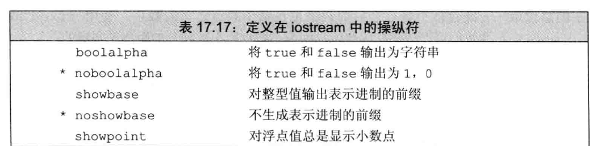

PART 4 高级主题

# 17 标准库特殊设施

## 17.1 tuple 类型
tuple 是类似 pair 的模板  
不同 tuple 类型的成员类型不同，但一个 tuple 可以有任意数量的成员，每个确定的 tuple 类型的成员数目是固定的，但一个 tuple 类型的成员数目可以与另一个 tuple 类型不同  
tuple 类型及其伴随类型的函数都定义在 tuple 头文件中

1. `tuple<T1,T2, ..., Tn> t;`  t 是一个 tuple，成员数为 n，第 i 个成员的类型为 Ti，所有组成员都进行值初始化
2. `tuple<T1,T2, ..., Tn> t(v1, v2, ..., vn);`  t 是一个 tuple，成员类型是 T1..Tn，每个成员用对应的初始值 vi 进行初始化，此构造函数时 explicit 的
3. `make_tuple(v1, v2, ..., vn)` 返回一个用给定初始值初始化的 tuple，tuple 的类型从初始值的类型推断
4. `t1 == t2`  当两个 tuple 具有相同数量的成员且成员对应相等时，两个 tuple 相等，这两个操作使用成员的 == 运算符来完成，一旦发现某队成员不等，接下来的成员就不用比较了
5. `t1 relop t2`  tuple 的关系运算使用字典序。两个 tuple 必须具有相同数量的成员。使用 < 运算符比较 t1 的成员和 t2 中的对应成员
6. `get<i>(t)` 返回 t 的第 i 个数据成员的引用；如果 t 是一个左值，结果是一个左值引用；否则，结果是一个右值引用。 tuple 的所有成员都是 public 的
7. `tuple_size<tupleType>::value`  一个类模板，可以通过一个 tuple 类型来初始化。它有一个名为 value 的 `public constexpr static` 数据成员，类型为 size_t, 表示给定 tuple 类型中成员的数量
8. `tuple_element<i, tupleType>::type` 一个类模板，可以通过一个整形常量和一个 tuple 类型来初始化，有一个名为 type 的 public 成员，表示给定 tuple 类型中指定成员的类型

可以将 tuple 看作一个快速而随意的数据结构

### 17.1.1 定义和初始化 tuple
定义一个 tuple时，需要指出每个成员的类型  
可以使用 tuple默认构造函数对每个成员进行初始化  
该构造函数为 explicit 的，必须使用直接初始化语法
```cpp
tuple<size_t, size_t, size_t> threeD = {1,2,3}; //incorrect
tuple<size_t, size_t, size_t> threeD{1,2,3}; //correct
```
可以使用 make_tuple 生成 tuple 对象，
其使用初始值的类型来推断 tuple 的类型

- 访问 tuple 的成员
    - 使用 get 标准库函数模板
    - 指定一个显式模板实参指出像访问第几个成员
        ```cpp
        auto book = get<0>(item);  //返回第一个成员
        auto cnt = get<1>(item);  //返回第二个成员
        auto price = get<2>(item)/cnt;  //返回item最后一个成员
        get<2>(item) *= 0.8; //打折20%
        ```
    - <> 中必须是一个整型常量表达式，从 0 开始计数
    - 查询 tuple 成员的数量和类型
        ```cpp
        typedef decltype(item) trans;
        size_t sz = tuple_size<trans>::value; // 返回成员个数
        tuple_element<1, trans>::type cnt = get<1>(item); // cnt 是一个 int
        ```
    - 关系和相等运算符
        - tuple 的关系和相等运算符的行为类似容器的对应操作，逐对比较左侧 tuple 和右侧 tuple 的成员
        - 只有两个 tuple 具有相同数量的成员时，才可以比较它们，且每对成员的的比较运算符都必须合法
        - tuple 定义了 < 和 == 运算符，可以将 tuple 序列传递给算法，可以在无序容器中将 tuple 作为关键字类型 

### 17.1.2 使用 tuple 返回多个值
tuple 的一个常见用途是从一个函数返回多个值
- 返回 tuple 的函数
    - 编写查找给定书籍的函数
        
        ```cpp
        typedef tuple<vector<Sales_data>::size_type, vector<Sales_data>::const_iterator, vector<Sales_data>::const_iterator> matches;
        vector<matches> findBook(const vector<vector<Sales_data>> &files, cosnt string &book){
            vector<matches> ret;
            for (auto it = files.cbegin(); it != files.cend(); ++it){
                auto found = equal_range(it->cbegin(),it->cend(),book, compareIsbn);
                if (found.first != found.second){
                    ret.push_back(make_tuple(it - files.cbegin(), found.first, found.second));
                }
            }
            return ret;
        }
        ```
    - equal_range 标准库算法
        - 前两个实参是输入序列的爹大气，第三个参数是一个值
        - 默认情况下 equal_range 使用 < 运算符来比较元素
        - 返回一个迭代器 pair，表示元素的范围，若未找到则两个迭代器相等，表示空范围，否则 pair 的 first 成员表示第一台匹配的记录，second 表示匹配的尾后尾置 
- 使用函数返回的 tuple
    ```cpp
    void reportResults(istream &in, ostream &os, const vector<vector<Sales_data>> &files){
        string s;
        while (in >> s){
            auto trans = findBook(files, s);
            if (trans.empty()){
                cout << s << "not found in any stores" << endl;
            }
            for (const auto &store : trans){
                os << "stores" << get<0>(store) <<" sales: "<< accumulate(get<1>(store), get <2>(store), Sales_data(s)) << endl;
            }
        }
    }
    ```
    
## 17.2 bitset 类型
标准库定义了 bitset 类，使得位运算的使用更为容易，并且能够处理超过最长整型类型大小的位集合  
定义在 头文件 bitset 中

### 17.2.1 定义和初始化 bitset
bitset 类是一个类模板，类似 array 类，具有固定的大小  
当我们定义一个 bitset 时，需要声明它包含多少个二进制位  
`bitset<32> bitvec(1U); //32位 低位为1，其他位为0`
大小必须是一个常量表达式，这条语句定义 bitvec 为一个包含 32 位的 bitset  
通过位置访问，二进制位的位置从 0 开始编号， 
bitvec 包含编号从 0 到 31 的 32 个二进制位  
编号从 0 开始的二进制位被称为低位，编号到 31 结束的二进制位被称为高位
- 初始化 bitset 的方法
    - bitset<n> b; b 有 n 位；每一位均为 0，此构造函数是一个 constexpr
    - bitset<n> b(u); b 是 unsigned long long 值 u 的低 n 位的拷贝，如果 n 大于 unsigned long long 的大小，则 b 中超过 unsigned long long 的高位被置为 0，此构造函数是一个 constexpr
    - bitset<n> b(s, pos, m, zero, one); b 是 string s 从位置 pos 开始 m 个字符的拷贝。s 只能包含字符 zero 或 one; 如果 s 包含任何其他字符，构造函数会抛出 invalid_argument 异常。字符在 b 中分别保存为  zero 和 one。 pos 默认为 0，m 默认为 string::npos, zero 默认为 '0'， one 默认为 '1' 
    - bitset<n> b(cp, pos, m, zero, one); 与上一个构造函数相同 ，从 cp 指向的字符数组中拷贝字符，如果未提供 m，则 cp 必须指向一个 C 风格字符串，如果提供了 m， 则从 cp 开始必须至少有 m 个 zero 或 one 字符
- 用 unsigned 值初始化 bitset
    - 用一个整数值来初始化 bitset 时，此值将被转换为 unsigned long long 类型并被当作位模式来处理
    - bitset 中的二进制位将是此模式的一个副本
    - 如果 bitset 的大小大于一个 unsigned long long 中的二进制数，则剩余的高位被置为 0，如果 bitset 的大小小于一个 unsigned long long 中的二进制位数，则只使用给定值中的低位，超出 bitset 大小的高位被丢弃
- 从一个 string 初始化 bitset
    - 可以从一个 string 或一个字符数组指针来初始化 bitset，两种情况下，字符都直接表示位模式
    - 如果 string 包含的字符数比 bitset 少，则 bitset 的高位被置为 0
    - string 的下标编号习惯与 bitset 正相反，string 中下标最大的字符用来初始化 bitset 中的低位
        ```cpp
        string str("1111111000000111");
        bitset<32> bitvec5(str, 5, 4); //从 str[5]开始的 4个二进制位
        bitset<32> bitvec6(str, str.size()-4); // 使用最后四个字符
        ```

## 17.3 正则表达式
正则表达式是一种描述字符序列的方法  
C++ 正则表达式库(RE库)，定义在 regex 中
- regex 表示有一个正则表达式的类
- regex_search 寻找第一个与正则表达式匹配的子序列
- regex_replace 使用给定格式替换一个正则表达式
- sregex_iterator 迭代器适配器，调用 regex_search 来遍历一个 string 中所有匹配的子串
- smatch 容器类，保存在 string 中搜索的结果
- ssub_match string 中匹配的子表达式的结果

函数 regex_match 和 regex_search 确定一个给定字符序列与一个给定 regex 是否匹配，如果输入序列中一个子串与表达式匹配，则 regex_search 函数返回 true  
- regex_search 和 regex_match 的参数  返回 bool 值，指出是否找到匹配
    - (seq, m, r, mft) 在字符串 seq 中查找 regex 对象 r 中的正则表达式， seq 可以是一个 string、表示范围的一对迭代器以及一个指向空字符结尾的字符数组的指针
    - (seq, r, mft) m 是一个 match 对象，用来保存匹配结果的相关细节。m 和 seq 必须具有兼容的类型，mft 是一个可选的 regex_constants::match_flag_type 值


### 17.3.1 使用正则表达式库
```cpp
string pattern("[^c]ei");
pattern = "[[:alpha:]]*" + pattern + "[[:alpha:]]";
regex r(pattern);
smatch results;
string test_str = "receipt freind theif receive";
if (regex_search(test_str, result, r))
    cout << result.str() << endl;
```

[^c] 表明希望匹配任意不是 'c' 的字符，而 [^c]ei 指出想要匹配这种字符后接 ei 的字符串  
默认情况下 regex 使用的正则表达式语言为 ECMAScript  
`[[::alpha]]` 匹配任意字幕  
`+` `*` 表示希望一个或多个 或 零个或多个 匹配  `[[::alpha:]]*` 将匹配零个或多个字母

- 指定 regex 对象的选项
    - 当我们定义一个 regex 或是对一个 regex 调用 assign 为其赋予新值时，可以指定一些标志来影响 regex 如何操作，这些标志控制 regex 如何操作，控制 regex 对象的处理过程


编写一个正则表达式来识别上述任何一种扩展名邮寄其他普通文件扩展名

```cpp
regex r("[[:alnum:]]+\\.(cpp|cxx|cc)$", regex::icase);
smatch results;
string filename;
while(cin >> filename)
    if (regex_search(filename, results, r))
        cout << results.str() << endl;
```

- 指定或使用正则表达式时的错误
    - 可以将正则表达式本身看作用一种简单程序设计语言编写的程序，正则表达式是在运行时，当一个 regex 对象被初始化或被赋予一个新模式时，才被“编译”的，与任何其他程序设计语言一样
    - 一个正则表达式的语法是否正确是在运行时解析的
    - 如果编写正则表达式存在错误，则在运行时会抛出一个类型为 regex_error 的异常，类似标准异常类型，regex_error 有一个 what 操作来描述发生了什么错误
    - regex error 还有名为 code 的成员，用来返回某个错误类型对应的数值编码
        ```cpp
        try {
            regex r("[[:alnum:]+\\.(cpp|cxx|cc)$", regex::icase);
        } catch (regex_error e)
        { cout<< e.what() << "\ncode:" << e.code() << endl; }
        ```
    - 正则表达式错误类型
        

- 正则表达式类和输入序列类型
    - 输入可以是普通 char 数据或 wchar_t 数据，字符可以保存在标准库 string 或是 char 数组中。 RE 为这些不同的输入序列都定义了对应的类型
    - 标准库还定义了一个 wregex 类保存 wachar_t，其操作与 regex 完全相同，两者唯一的差别是 wregex 的初始值必须使用 wchar_t 而不是 char
    - 匹配和迭代器类型更为特殊，类型的差异不仅在于字符类型，还在于序列是在标准库 string 中还是在数组中，smatch 表示 string 类型的输入序列; cmatch 表示字符数组序列; wsmatch 表示宽字符串 (wstring) 输入; wcmatch 表示宽字符数组
    - 对应的 string 版本 RE 库组件
        - `string`  regex, smatch, ssub_match, sregex_iterator
        - `const char*` regex, cmatch, csub_match, cregex_iterator
        - `wstring` wregex, wsmatch, wssub_match, wsregex_iterator
        - `const wchar_t*` wregex, wcmatch, wcsub_match, wcregex_iterator


### 17.3.2 匹配与 regex 迭代器类型
使用 sregex_iterator 来获得所有匹配
- sergex_iterator 操作
    |||
    |---|---|
    |`sregex_iterator it(b, e, r);`|一个 seregex_iterator，遍历迭代器 b 和 e 表示的 string。调用 sregex_search(b, e, r) 将 it 定位到输入中第一个匹配的位置|
    |`sregex_iterator end;`|sregex_iterator 的尾后迭代器|
    |`*it` <br> `it->`|根据最后一个调用 regex_search 的结果，返回一个 smatch 对象的引用或一个指向 smatch 对象的指针|
    |`++it` <br> `it++`|从输入序列当前匹配位置开始调用 regex_search。前置版本返回递增后迭代器，后置版本返回旧值|
    |`it1 == it2` <br>`it1 != it2`|如果两个 sregex_iterator 都是尾后迭代器，则它们相等两个非尾后迭代器是从相同的输入序列和 regex 对象构造，则它们相等|
    
    当将一个 sregex_iterator 绑定到一个 string 和一个 regex 对象时，迭代器自动定位到给定 string 中第一个匹配位置  
    sregex_iterator 构造函数对给定 string 和 regex 调用 regex_search, 当我们解引用迭代器时，会得到一个对应最近一次搜索结果的 smatch 对象，递增迭代器时，调用 regex_search 在输入 string 中查找下一个匹配
- 使用 sregex_iterator
    ```cpp
    string pattern("[^c]ei");
    pattern = "[[:alpha:]]*" + pattern + "[[:alpha:]]*";
    regex r(pattern, regex::icase);
    for (sregex_iterator it(file.begin(), file.end(), r), end_it; it != end_it; ++it)
        cout << it->str() << endl;
    ```
- 使用匹配数据
    - smatch 和 ssub_match 允许我们获得匹配的上下文
    - 匹配类型有 prefix 和 suffix 成员，分别返回舒徐序列中当前匹配和之后部分的 ssub_match 对象
    - 一个 ssub_match 对象有两个名为 str 和 length 的成员，分别返回匹配的 string 和该 string 的大小
    - it -> prefix().str() | it -> str | it ->suffix().str()
        ```cpp
        for (sregex_iterator it(file.begin(),file.end(), r), end_it; it != end_it; ++it){
            auto pos = it->prefix().length();
            pos = pos >40 ? pos -40 : 0;
            cout << it ->prefix().str().substr(pos) << "\n\t\t>>>" << it->str() <<"<<<\n" << it->suffix().str().substr(0,40) << endl
        }
        ```
    - smatch 操作
        


### 17.3.3 使用子表达式
正则表达式中的模式通常包含一个或多个子表达式，一个子表达式是模式的一部分，本省也具有意义  
正则表达式语法通常用括号表示子表达式  
匹配对象除了提供匹配整体的相关信息外，还提供访问模式中每个子表达式的能力  
子匹配是按位置来访问的，第一个子匹配位置为 0，表示整个模式对应的匹配，随后是每个子表达式对应的匹配  
eg  
    filename -- foo.cpp 
results.str(0) -- foo.cpp 
results.str(1) -- foo
results.str(2) -- cpp

- 子表达式用于数据验证
    - 子表达式的一个常见用途是验证必须匹配特定格式的数据
    - ECMAScript 正则表达式语言的一些特性
        - `\{d}` 表示单个数字，而 `\{d}{n}` 表示一个 n 个数字的序列
        - 在方括号中的字符集合表示匹配这些字符中任意一个 (eg : `[-. ]`匹配短横线，点或空格)
        - 后接 `?` 的组件是可选的
        - 类似 C++， ECMAScript 使用反斜线表示一个字符本身而不是其特殊含义，由于模式包含括号，而括号是 EMCMAScript 中的特殊字符，因此必须使用 `\()` 来表示括号是我们模式的一部分而不是特殊字符
        - 反斜线是 C++ 特殊字符，在模式中出现 \ 的地方，必须用一个额外的反斜线来告知 C++ 需要一个反斜线字符而不是一个特殊符号
- 使用子匹配操作
    - 适用于 ssub_match, csub_match, wssub_match, wcsub_match
    - `matched` : 一个`publicboo`l数据成员，指出此`ssub_match` 是否匹配了
    - `first` `second` : `public` 数据成员, 指向匹配序列首元素和尾后位置的迭代器，如果未匹配，则 `first `和 `second` 是相等的
    - `length()` : 匹配的大小，如果 `match` 为 false，则返回 0
    - `str()` : 返回一个包含输入中匹配部分的 string，如果 `matched` 为 false，则返回空 string
    - `s = ssub` : 将 `ssub_match` 对象 ssub 转化为 string 对象 s，等价于 `s=ssub.str()` 转换运算符不是 explicit 的

### 17.3.4 使用 `regex_replace`
正则表达式还可以用在我们想将找到的序列替换为另一个序列的时候  
调用 `regex_replace`，接受一个输入字符序列和一个 `regex` 对象，还接受一个描述我们想要的输出形式字符串
- 正则表达式替换操作
    - `m.format(dest,fmt,mft)`  `m.format(fmt,mft)`
        - 使用格式字符串 fmt 生成格式化输出，匹配在 m 中，可选的 `match_flag_type` 标志在 mft 中  第一个版本写入迭代器 dest 指向的目的位置并接受 fmt 参数，可以是一个 string，也可以是表示字符数组中范围的一对指针  第二个版本返回一个 string，也可以是一个指向空字符结尾的字符数组的指针  mft 的默认值为 `format_default`
    - `regex_replace(dest, seq, r, fmt, mft)`  `regex_replace(seq, r, fmt, mft)`
        - 遍历 seq ，用 regex_search 查找与 regex 对象 r 匹配的子串  使用格式化字符串 fmt 和可选的  `match_flag_type` 标志来生成输出  第一个版本将输出写入到迭代器 dest 指定的位置，并接受一对迭代器 seq 表示范围  第二个版本返回一个 string，保存输出，且 seq 既可以是一个 string，也可以是指向空字符串结尾的字符中数组的指针，且 mft 的默认值为 `match_default`
    - 可以用 `$` 后跟子表达式的索引号来表示一个特定的子表达式
- 只替换输入序列的一部分
- 用来控制匹配和格式的标志
    - 标准库定义了用来在替换过程中控制匹配或格式的标志，这些标志可以传递给函数 regex_search 或 regex_match 或是类 smatch 的 format 成员
    - 匹配和格式化标志的类型名为 match_flag_type，值定义在 regex_constants 命名空间中
    - 为了使用 regex_constants 中的名字，需要在名字前同时加上两个命名空间的限定符  `using std::regex_constants::format_no_copy`  `using namespace std::regex_constants;`
    - 匹配标志 （定义在`regex_constants::match_flag_type`中）
        - `match_default` : 等价于 format_default
        - `match_not_bol` : 不将首字符作为行首处理
        - `match_not_eol` : 不将尾字符作为行尾处理
        - `match_not_bow` : 不将首字符作为单词首处理
        - `match_not_eow` : 不将首字符作为单词尾处理
        - `match_any` : 如果存在多余一个匹配，则可返回任意一个匹配
        - `match_not_null` : 不匹配任何空序列
        - `match_continuous` : 匹配必须从输入的首字符开始
        - `match_prev_avail` : 输入序列包含第一个匹配之前的内容
        - `format_default` : 用 ECMAScript 规则替换字符串
        - `format_sed` : 用 POSIX sed 规则替换字符串
        - `format_no_copy` : 不输出输入序列中未匹配的部分
        - `format_first_only` : 只替换子表达式的第一次出现
- 使用格式标志
    - 默认情况下 regex_replace 输出整个输入序列
    - 未与正则表示式匹配的部分会原样输出
    - 匹配的部分按格式字符串指定的格式输出
    - 可以通过 regex_replace 调用中指定 format_no_copy 来改变这种默认行为

## 17.4 随机数
C 和 C++ 依赖于 C 库函数 rand 生成随机数，此函数生成均与分布的伪随机整数，每个随机数的范围在 0 和一个系统相关的最大值(至少为 32767)之间  
rand 函数有一个问题，即使不是大多数，也有很多程序需要不同范围的随机数，为了解决试图转换 rand 生成的随机数的范围、类型或分布时，会引入非随机性  
定义在头文件 random 中的随机数库通过一组协作的类来解决：随机数引擎类和随机数分布类，一个引擎类可以生成 unsigned 随机数序列，一个分布类使用一个引擎类生成指定的，在给定范围内的，服从特定概率分布的随机数  
- 随机数库的组成
    |||
    |---|---| 
    |引擎|类型，生成随机 unsigned 整数序列|
    |分布|类型，使用引擎返回服从特定概率分布的随机数|
- C++ 程序不应该使用库函数 rand，而应使用 default_random_engine 类和恰当的分布类对象

### 17.4.1 随机数引擎和分布
随机数引擎式函数对象类  
定义了一个调用运算符，该运算符不接受参数并返回一个随机 unsigned 整数  
调用一个随机数引擎对象来生成原始随机数
```cpp
default_random_engine e;
for (size_t = 0; i < 10; ++i)
    cout << e() << endl;
```

- 随机数引擎操作  
    |||  
    |---|---|
    |`Engine e;`|默认构造函数，使用该引擎型默认的种子|
    |`Engine e(s);`|使用整数值 s 作为种子|
    |`e.seed(s)`|使用种子 s 重置引擎的状态|
    |`e.min()` <br> `e.max`|此引擎可生成的最小值和最大值|
    |`Engine::result_type`|此引擎生成的 unsigned 整数类型|
    |`e.discard(u)`|将此引擎推进 u 步; u 的类型为 unsigned long long|
- 分布类型和引擎
    - 为了得到在一个指定范围的数，需要使用一个分布类型的对象
        ```cpp
        uniform_int_distribution<unsigned> u(0,9);
        default_random_engine e;
        for (size_t i =0; i < 10; ++i)
            cout << u(e) << endl;
        ```
    - 分布类型定义了一个调用运算符，接受一个随机数引擎作为参数，分布对象使用它的引擎参数生成随机数，并将其映射到指定的分布
    - 当我们说随机数发生器时，是指分布对象和引擎对象的组合
- 比较随机数引擎和 rand 函数
    - e.min() e.max() 返回系统定义范围
- 引擎生成一个数值序列
    - 对一个给定的发生器，每次运行程序都会返回相同的数值序列
    - 将引擎和关联的分布对象定义成 static 的，使其在接下来的调用之间也会博爱吃住状态
    - 一个给定的随机数发生器一直会生成相同的随机数序列，一个函数如果定义了局部的随机数发生器，应该将其(包括引擎和分布对象)定义为 static 的，否则，每次 调用函数都会生成相同的序列
- 设置随机数发生器种子
    - 为引擎设置种子有两种方式，在创建引擎对象时提供种子，或者调用引擎的 seed 成员
    - 最常用的方法是调用系统函数 time
        - 定义在头文件 ctime 中
        - 返回从一个特定时刻到当前经过了多少秒
        - 函数 time 接受单个指针参数，指向用于写入时间的数据结构，如果此指针为空，则函数简单地返回时间
        - `default_random_engine e1(time(0))`
        - 由于 time 以秒计，此方式只适用与生成种子地间隔为秒级或更长地应用
    - 如果程序作为一个自动过程的一部分反复运行，将 time 地返回值作为种子地方式就无效了，可能多次使用地都是相同地种子

### 17.4.2 其他随机数分布
随机数引擎生成 unsigned 数，范围内的每个数都生成的概率相同，应用程序常常需要不同类型或不同分布地随机数，标准库通过定义不同随机数分布对象来满足两方面要求
- 生成随机数
    - 程序需要一个随机浮点数地源，特别是从 0 到 1 之间的随机数
    - 定义一个 uniform_real_distribution 类型地对象，让标准库来处理从随机整数到随机浮点数地映射，
        ```cpp
        default_random_engine e;
        uniform_real_distribution<double> u(0,1);
        for (size_t i = 0; i < 10; ++i)
            cout << u(e) << " ";
        ```
    - 分布类型地操作
        |||
        |---|---|
        |`Dist d;`|默认构造函数，使 d 准备好被使用|
        |`d(e)`|用相同地 e 连续调用 d 地话，会根据 d 的分布式类型生成一个随机数序列; e 是一个随机数引擎对象|
        |`d.min() <br> d.max()`|返回 d(e) 能生成的最小值和最大值|
        |`d.reset()`|重建 d 的状态，使得随后对 d 的使用不依赖于 d 已经生成的值|
- 使用分布的默认结果类型
    - 分布类型都是模板，具有单一的模板类型参数，表示分布生成的随机数的类型
    - 每个分布模板都有一个默认模板实参，生成浮点值的分布类型默认生成 double 值，而生成整型值的分布默认生成 int 值，由于分布类型只有一个模板参数，当希望使用默认随机数类型时要记得在模板名之后使用空尖括号
        `uniform_real_distribution<> u(0,1);`
- 生成非均匀分布的随机数
    - 正态分布
        ```cpp
        default_random_engine e;
        normal_distribution<> n(4,1.5);
        vector<unsigned> vals(9);
        for (size_t i = 0; i != 200; ++i){
            unsigend v = lround(n(e));
            if (v < vals.size())
                ++vals[v];
        }
        for (size_t j = 0; j != vals.size(); ++j)
            cout << j << ": " << string(vals[j], '*') << endl;
        ```
- bernoulli_distribution 类
    - 不接受模板参数，返回一个布尔值，然会 true 的概率为常熟 0.5
    - 由于引擎返回相同的随机数序列，所以必须在循环外声明引擎对象，否则，每步循环都会创建一个新引擎，从而每步循环都会生成相同的值，类似的，分布对象也要保持状态，因此也应该在循环外定义

## 17.5 IO 库再探
格式控制  
未格式化 IO  
随机访问  

### 17.5.1 格式化输入与输出
除了条件状态外，每个 iostream 对象还维护一个格式状态来控制 IO 如何格式化的细节，格式状态控制格式化的某些方面  
标准库定义了一组操作符来修改流的格式状态  
一个操作符是一个函数或是一个对象，会影响流的状态，并能用作输入或输出运算符的运算对象  
endl 输出一个换行符并刷新缓冲区  
- 很多操纵符改变格式状态
    - 控制熟知的输出形式以及控制补白的数量和位置
    - 大多数改变格式状态的操作符都是设置/复原成对的: 一个操作符用来将格式状态设置为一个新值，而另一个用来将其复原，恢复为正常的默认格式
    - 当操作符改变流的格式状态时，通常改变后的状态对所有后续 IO 都生效
- 控制布尔值的格式
    - 操作符改变对象的格式状态的一个例子是 boolalpha 操作符
        - 向 cout 写入了 boolalpha ，就改变了 cout 打印 bool 值的方式，后续打印 bool 值的操作都会打印 true 或 false 而非 1 或 0
        - 使用 noboolalpha 将内部状态恢复为默认格式
- 指定整型值的进制
    - 默认情况下，整型值的输入输出使用十进制，使用操作符 hex, oct, dec 将其改为 十六进制，八进制，或是改回十进制
    - 只影响整型运算对象，浮点值的表示形式不受影响
- 在输出中指出进制
    - showbase 操作符会在结果中显示进制，遵循与整型常量中指定进制相同的规范
        - 前导 0x 表示十六进制
        - 前导 0 表示八进制
        - 无前导字符串表示十进制
        - noshowbase 恢复原状态
    - uppercase 操作符来输出大写的 X 并将十六进制数字 a-f 以大写输出
- 控制浮点数格式
    - 以多高精度打印浮点数
        - 默认情况下按六位数字精度打印
    - 数值是是大因为十六进制，定点十进制还是科学计数法形式
        - 默认选择一种可读性更好的格式
    - 对于没有小数部分的浮点值是否打印小数点
        - 默认没有小数部分不打印小数点
    - 指定打印精度
        - 通过调用 IO 对象的 precision 成员或使用 setprecision 操作符来改变精度
            - precision 成员为重载的
                - 一个版本接受一个 int 值，将精度设置为此值
                - 另一个版本不接受参数，返回当前竞渡之
            - setprecision 操作符接受一个参数，用来设置精度
            - 定义在头文件 iomanip 中
    - 定义在 iostream 中的操作符
        
        
    - 指定浮点数计数法
        - 除非需要控制浮点数的表示形式，否则标准库选择计数法是最好的方式
        - 操作符 scientific 改变流的状态来使用科学技术法
        - 操作符 fixed 改变流的状态来使用定点十进制
        - 操作符 hexfloat 强制使用十六进制格式
        - 操作符 defaultfloat 将流恢复到默认状态
    - 打印小数点
        - showpoint 操作符强制打印小数点
        - noshowpoint 恢复
    - 输出补白
        - setw 指定下一个数字或字符串值的最小空间
        - left 表示左对齐输出
        - right 表示右对齐输出，右对齐是默认格式
        - internal 控制负数的符号位置，左对齐符号，右对齐值，用空格填满所有中间空间
        - setfill 允许指定一个字符代替默认的空格来补白输出
- 控制输入格式
    - 操作符 noskipws 会令输入运算符读取空白符，而不是跳过它们
    - skipws 恢复默认行为

### 17.5.2 未格式化的输入/输出操作
标准库还提供了一组低层操作，支持未格式化 IO ，这些操作允许我们将一个流当作一个无解释的字节序列来处理

- 单字节操作
    - 有几个未格式化操作每次一个字节地处理流，会读取而不是忽略空白符
    - 单字节低层 IO 操作
        - `is.get(ch)` 从 istream is 读取下一个字节存入字符 ch 中，返回 is
        - `os.put(ch)` 将字符 ch 输出到 ostream os，返回 os
        - `is.get()` 将 is 地下一个字节作为 int 返回
        - `is.putback(ch)` 将字符 ch 放回 is，返回 is
        - `is.unget()` 将 is 向后移动一个字节，返回 is
        - `is.peek()` 将下一个字节作为 int 返回，但不从流中删除它
- 将字符放回输入流
    - 标准库提供了三种方法退回字符，有着细微地差别
        - `peak` 返回输入流中下一个字符地副本，但不会将它从流中删除，`peek` 返回的值仍然留在流中
        - `unget` 使得输入流向后移动，从而最后读取的值又回到流中，即使我们不知道最后从流中读取到什么值，仍然可以调用 unget
        - `putback` 是更特殊版本的 `unget`，退回从流中读取的最后一个值，但它接受一个参数，此参数必须与最后读取的值相同
    - 一般情况下，在读取下一个值之前，标准库保证我们可以退回最多一个值，即标准库不保证在中间不进行读取操作的情况下能连续调用 `putback` 或 `unget`
- 从输入操作返回的 int 值
    - 函数 peek 和无参的 get 版本都以 int 类型从输入流返回一个字符
        - 原因是可以返回文件尾标记
    - 返回 int 的函数将它们要返回的字符先转换为 unsigned char 然后再将结果提升到 int，即使又负值，返回的 int 也是正值
    - 标准库使用负值表示文件尾，可以保证与任何合法字符的值都不同
    - 头文件 cstdio 定义了一个名为 EOF 的 const，可以用来检测从 get 返回的值是否是文件尾
        ```cpp
        int ch;
        while ((ch = cin.get()) != EOF)
            cout.put(ch);
        ```
- 多字节操作
    - 一些未格式化 IO 操作一次处理大块数据
    
    - get和 getline 函数接受相同的参数，他们的行为类似但不相同，在两个函数中，sink 都是一个 char 数组，用来保存数据。
    - 两个函数都一致读取数据，直至下面条件之一发生
        - 已读取了 size-1 个字符
        - 遇到了文件尾
        - 遇到了分隔符
    - 处理分隔符的方式butong
        - get 将分割符流作 istream 中的下一个字符
        - getline 读取并丢弃分隔符
    - 一个常见的错误是本想从流中删除分割符，却忘了做
- 确定读取了多少个字符
    - 可以调用 gcount 来确定最后一个未格式化输入操作读取了多少个字符，应该在任何后续未格式化输入操作之前调用 gcount
    - 如果在调用 gcount 之前调用了 peek unget putback 则gcount 返回值为 0


### 17.5.3 流随机访问
各种流类型通常都支持对流中数据的随机访问，可以重定位流，使之跳过一些数据  
标准库提供了一堆函数，来定位(seek)到流中给定的位置，以及(tell)我们当前的位置  
随机 IO 本质上是依赖于系统的，为了理解如何使用这种特性，必须查询系统文档  
虽然标准库为所有类型的流都定义了 seek 和 tell 函数，但它们是否会做有意义的事请依赖于流绑定到哪个设备，在大多数系统中，绑定到 cin cout cerr 和 clog 的流不支持随机访问  

由于 istream 和 ostream 类型通常不支持随机访问，所以本节剩余内容只适用于 fstream 和 sstream 类型

- seek 和 tell 函数
    - IO 类型维护一个标记来确定下一个读写操作要在哪里进行
    - 提供两个函数
        - 通过将标记 seek 到一个给定位置来重定位它
        - tell 告知当前标记位置
    - g 版本对应读取
    - p 版本对应写入
- 只有一个标记
    - 在单一流中只维护单一标记，并不存在独立的读标记和写标记
    - 在可读写的流中，标准库将 g 和 p 版本的读写位置都映射到这个单一的标记
    - 由于只有单一的标记，因此只要我们在读写操作间切换，就必须进行 seek 操作来重定位标记
- 重定位标记
    - seek 函数两个版本
        - 一个移动到文件中的绝对地址  `seek(new_position);` 
        - 一个移动到一个给定位置的指定偏移量  `seek(offset, from);`
        - 参数 new_positon 和 offset 的类型分别是 pos_type 和 off_type
- 访问标记
    - 函数 tellg 和 tellp 返回一个 pos_type 值，表示流的当前位置
    - tell 函数通常用来记住一个位置，以便移后在定位回来
        ```cpp
        ostringstream writeStr;
        ostringstream::pos_type mark = writeStr.tellp();
        if (cancelEntry)
            writeStr.seekp(mark);
        ```
- 读写同一个文件
    - 给定一个要读取的文件，在此文件的末尾写入新的一行，这一行包含文件中每行的相对起始位置
    ```cpp
    int main(){
        fstream inOut ("copyOut", fstream::ate | fstream::in | fstream::out);
        if (!inOut) {
            cerr << "Unable to open file!" << endl;
            return EXIT_FALLURE;
        }
        auto end_mark = inOut.tellg();
        inOut.seekg(0, fstream::beg);
        size_t cnt = 0;
        string line;
        while (inOut && inOut.tellg() != end_mark && getline(inOut,line)){
            cnt += line.size() + 1;
            auto mark = inOut.tellg();
            inOut.seekp(0,fstream::end);
            inOut << cnt;
            if (mark != end_mark) inOut << " ";
            inOut.seekg(mark);
        }
        inOut.seekp(0, fstream::end);
        inOut << '\n';
        return 0;
    }
    ```
    - in out 指出想读写同一个文件，ate 会将读写标记定位到文件尾
    - 将原文件尾标记在 end_mark 中


# 18 用于大型程序的工具


## 18.1 异常处理
异常处理机制允许程序中独立开发的部分能够在运行时就出现的问题进行同行并作出对应的处理  
异常使得我们能够将问题的检测与解决过程分离开来，程序的一部分负责检测问题的出现，然后解决该问题的任务传递给程序的另一部分

### 18.1.1 抛出异常
通过抛出一条表达式来引发一个异常，被抛出的表达式的类型以及当前的调用链共同决定了那段处理代码将被用来处理该异常  
被选中的处理代码是在调用链中与抛出对象类型匹配的最近的处理代码  
当执行一个 throw 时，跟在 throw 后面的语句将不再被执行，程序的控制权从 throw 转移到与之匹配的 catch 模块  
- 控制权从一处转移到另一处
    - 沿着调用链的函数可能会提早退出
    - 一旦程序开始执行异常处理代码，则沿着调用链创建的对象将被销毁
- 栈展开
    - 当抛出一个异常后，程序暂停当前函数的执行过程并立即开始寻找与异常匹配的 catch 子句，如果找到了匹配的 catch ，就使用该 catch 处理异常，否则像上层继续查找
    - 栈展开过程沿着嵌套函数的调用链不断查找，直到找到了异常匹配的 catch 子句为止，或者可能一直没找到匹配的 catch ，则退出主函数后查找过程终止
    - 如果没找到匹配的 catch 子句，程序将退出，因为异常通常被认为是妨碍程序正常执行的事件，所以一旦引发了某个异常，当找不到匹配的 catch 时，程序将调用标准库函数 terminate，terminate 负责终止程序的执行过程
    - 一个异常如果没有被捕获，则它将终止当前程序
- 栈展开的过程中对象被自动销毁
    - 在栈展开过程中，位于调用链上的语句块可能会提前退出
    - 通常情况下，程序在这些块中创建了一些局部条件
- 析构函数与异常
    - 析构函数总是会被执行，但是函数中负责释放资源的代码却可能被跳过，这一特点对于我们如何组织程序结构有重要影响， 如果一个块分配了资源，并且在负责释放这些资源的代码前面，则释放资源的代码将不会被执行
    - 在栈展开的过程中，运行类型的局部对象的析构函数，因为这些析构函数是自动执行的，所以它们不应该抛出异常，一旦在栈展开的过程中析构函数抛出了异常，并且析构函数自身没能不哦到该异常，则程序将被终止
- 异常对象
    - 编译器使用异常抛出表达式来对异常对象进行拷贝初始化
    - 异常对象位于编译器管理的空间中，编译器确保无论最终调用的是哪个 catch 子句都能访问该空间，当异常处理完毕后，异常对象被销毁
    - 抛出指针要求在任何对应的处理代码存在的地方，指针所指的对象都必须存在

### 18.1.2 捕获异常
catch 子句中的异常声明看起来像是只包含一个形参的函数形参列表，像在形参列表中一样，如果 catch 无须访问抛出的表达式，可以忽略捕获形参的名字  
声明的类型决定了处理代码所能捕获的异常类型，这个类型必须是完全类型，可以是左值引用，但不能是右值引用  
- 通过异常对象初始化异常声明中的参数
    - 如果 catch 的参数类型是非引用类型，则该参数是异常对象的一个副本，在 catch 语句内改变该参数实际上改变的是局部副本而非异常对象本身
    - 如果参数是引用类型，则和其他引用参数一样，该参数是异常对象的一个别名，此时改变参数也就是改变异常对象
    - 如果 catch 的参数是基类类型，则可以使用其派生类类型的异常对象对其进行初始化
        - 此时如果 catch 的参数是非引用类型，则异常对象将被切掉一部分，这与将派生类对象以值传递的方式传给一个普通函数差不多
        - 如果 catch 的参数是基类的引用，则该参数将以常规方式绑定到异常对象上
- 如果 catch 接受的异常与某个继承体系有关，则最好将该 catch 的参数定义成引用类型

- 查找匹配的处理代码
    - 在搜寻 catch 语句的过程中，最终找到的 catch 未必是异常的最佳匹配，相反，挑选出来的应该是第一个与异常撇皮的 catch 语句，因此，专门的 catch 应该置于整个 catch 列表的前端
    - 异常和 catch 的匹配规则有更多限制
        - 允许从非常量向常量的类型转化，一条非常量对象的 throw 语句可以匹配一个接受常量引用的 catch 语句
        - 允许从派生类向基类的类型转换
        - 数组被转换成指向数组元素类型的指针，函数被转换成指向该函数类型的指针
        - 除此之外包括标准算术类型转换和类类型转换其他所有转换规则都不能在匹配 catch 的过程中使用
    - 如果在多个 catch 语句的类型之间存在继承关系，则我们应该把继承链最底端的类放在前面，而将继承链最顶端的类放在后面
- 重新抛出
    - 一个单独的 catch 语句不能完整的处理某个异常，在执行了某些矫正操作之后，当前的catch 可能会决定由调用链更上层的函数处理异常  一条 catch 语句通过重新抛出的操作将异常传递给另外一个 catch 语句  此时重新抛出一个 throw 语句不包含任何表达式
    - 空的 throw 语句只能出现在 catch 语句或 catch 语句直接或间接调用的函数之内，如果在处理代码之外的区域遇到了空 throw 语句，编译器将调用 terminate  
    - 一个重现抛出语句并不指定新的表达式，而是将当前的异常对象沿着调用链向上传递
- 捕获所有异常的处理代码
    - 为了一次性捕获所有异常，使用省略号作为异常声明，这样代码陈伟捕获所有异常
    - catch(...) 通常与重现抛出语句一起使用，其中 catch 执行当前局部能完成的工作，随后重新抛出异常
    - 如果 catch(...) 与其他几个 catch 语句一起出现，则 catch(...) 必须在最后的位置，出现在捕获所有一场语句后面的 catch 语句将永远不会被压缩


### 18.1.3 函数 try 语句块与构造函数
通常情况下，程序执行的任何时刻都可能发生异常，特别是异常可能发生在处理构造函数初始值的过程中  
构造函数在进入其函数体之前首先执行初始值列表，处理构造函数初始值抛出的异常必须将高槽函数写成函数 try 语句块  
把 Blob 的构造函数置于一个函数 try 语句块中
```cpp
template <typename T>
Blob<T>::Blob(std::initializer_list<T> il) try : data (std::make_shared<std::vector<T>>(il)){

} catch(const std::bad_alloc &e) { handle_out_of_memory(e);}
```
处理构造函数初始值异常的唯一方法是将构造函数携程函数 try 语句块


### 18.1.4 noexcept 异常说明
C++ 11 中，可以通过 noexcept 说明指定某个函数不会抛出异常  
形式为 noexcept 紧跟在函数的参数列表后，用以表示该函数不会抛出异常  
对于一个函数来说，noexcept 说明要么出现在该函数的所有声明语句和定义语句中，要么依次也不出现，该说明应该在函数的尾置返回类型之前  
在成员函数中，noexcept 说明符需要在 const 及引用限定符之后，而在 final、ovvride 或虚函数 =0 之前  
- 违反异常说明
    - 一旦一个 noexcept 函数抛出了异常，程序会调用 terminate 以确保遵守不在运行时抛出异常的承诺
    - 通常情况下，编译器不能也不必再编译时验证异常说明
- 异常说明的实参
    - noexcept 说明符接受一个可选的实参，该实参必须能转换为 bool 类型，如果实参是 true，则函数不会抛出异常，如果实参是 false，则函数可能抛出异常
- noexcept 运算符
    - noexcept 说明符的实参常常与 noexcept 运算符混合使用
    - noexcept(e)
        - 当 e 调用的所有函数都做了不抛出说明且 e 本身不含有 throw 语句时，上述表达式为 ture，否则返回 false
    - 嵌套使用异常说明符  `void f() noexcept(noexcept(g()))`  如果 g 承诺了不会抛出异常，那 f 也不会抛出异常，如果 g 没有异常说明符，或者 g 虽然有异常说明符但允许抛出异常，则 f 也可能抛出异常
- 异常说明与指针、虚函数和拷贝控制
    - 尽管 noexcept 说明符不属于函数类型的一部分，但是函数的异常说明仍然会影响函数的使用
    - 函数指针及该指针所指的函数必须具有一致的异常说明，如果我们为某个指针做了不抛出异常说明，则该指针只能指向不抛出异常的函数，即使是承诺了不抛出异常的函数也可以
    - 如果一个虚函数承诺了它不会抛出异常，则后续派生出来的虚函数也必须做出同样的承诺，与之相反，如果基类的虚函数允许抛出异常，则派生类的对应函数既可以允许抛出异常，也可以不允许抛出异常